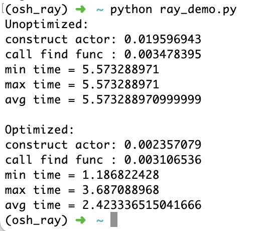

# Lab4 实验报告

选择 Ray （分布式计算）进行部署、测试、分析、评价工作。

本报告同时发布在 [WuTianming 的科大主页](http://home.ustc.edu.cn/~wutianming/oshlab4/) 上。

部署文档在 [这里](http://home.ustc.edu.cn/~wutianming/oshlab4/deployment.html)。

## 测试任务

为了模拟一般的分布式计算任务，选用计算斐波那契数列某一项的任务。任务主体代码如下：

```python
@ray.remote
class Fibonacci(object):
    def __init__(self, submit_time):
        self.val = 1
        self.preval = 1
        self.idx = 1
        self.result = -2
        self.time = submit_time

    def find(self, idx):
        L = self.idx
        R = idx
        for i in range(L, R):
            self.val, self.preval = self.val+self.preval, self.val
            self.val %= MOD
            self.preval %= MOD
        self.result = self.val

    def read(self):
        return (self.result, self.time)
```

任务采用 Ray Actor 模式编写，类似于微服务，每个 Ray Actor 拥有自己的数据存储和计算资源。每实例化一个 Ray Actor，都会在一个 Ray 结点上启动一个新的 Ray Worker 进程，专门执行该实例中的所有成员函数调用。


## 性能指标拟定

计算类的性能指标例如以下五点：

* 平均周转时间

  从调用 actor 构造函数之前，到 get 到结果之后所用的总时间。

* 吞吐率

  在负载稳定情况下，单位时间处理的任务数。

* 任务提交延迟

  actor 的构造耗时，以及 task 的提交耗时。

* 内存使用率

  Ray 节点上的内存使用率。

* 进程数、CPU 占用率

  Ray 节点上为了支持所有 actor 运行所需的进程数量，以及每个进程的 cpu 占用情况。

我们选用平均周转时间、任务提交延迟、进程数这三个指标进行测试。在高并发场景下，这些指标可以很好地刻画 Ray Actor 模式的响应特性。


## 单机性能测试和分析

进行单机部署（细节见部署文档）。

测试环境：

* MacBook Pro 13 inch, Mid 2020
* Intel core i5 (4 physical cores, 8 threads)
* 8 GB memory

运行测试任务，进行性能测试得到：

| actor 数量 | 每个 actor 计算项数 | 平均周转时间/s | 平均任务提交延迟/ms | 进程数 |
| ---------- | ------------------- | -------------- | ------------------- | ------ |
| 4          | 1e7                 | 5.3083         | 2.4237              | 4      |
| 4          | 3e7                 | 15.6126        | 2.4313              | 4      |
| 4          | 6e7                 | 30.8253        | 2.4426              | 4      |
| 8          | 1e7                 | 10.7094        | 1.2699              | 8      |
| 16         | 1e7                 | 22.8368        | 1.0476              | 16     |
| 24         | 1e6                 | 5.5972         | 0.9336              | 24     |
| 32         | N/A                 | Ray 崩溃       | 0.7656              | 32     |
| 64         | N/A                 | Ray 崩溃       | 0.7228              | 64     |

由任务的构造容易知道：任务的计算量与计算项数成正比。因此计算其比例得到平均每项用时，作为标化的计算效率指标：

| actor 数量 | 每个 actor 计算项数 | 平均每项用时/us |
| ---------- | ------------------- | --------------- |
| 4          | 1e7                 | 0.531           |
| 4          | 3e7                 | 0.520           |
| 4          | 6e7                 | 0.514           |
| 8          | 1e7                 | 1.071           |
| 16         | 1e7                 | 2.284           |
| 24         | 1e6                 | 5.597           |
| 32         | N/A                 | Ray 崩溃        |
| 64         | N/A                 | Ray 崩溃        |

分析数据可以得到以下规律：

* 每个 actor 都会创建一个独立的进程。当 actor 数过多时，Ray 节点会耗尽资源，进而崩溃
* 在测试使用的 4 核机器上，当 actor 数量超过 4 时，强行并发执行会导致争夺 cpu 资源，算力被均分到各个 actor 上，进而每个 actor 的周转时间都倍增
* 并发数过多时，不仅是简单的算力被均分，而且会引入额外的开销，即 24 个 actor 同时计算的用时远远长于 4 个 actor 同时连续计算 6 次
* 平均任务提交延迟这里指的是构造所有 actor 实例所耗费的平均时间。该延迟维持在 ms 级别，且随着连续构造的 actor 数量增加，逐渐稳定在 0.7 ms 左右


## 性能优化

容易看出，在上述测试用例中，当 actor 数量增加时，性能很快出现劣化，甚至导致进程崩溃。其症结在于 actor 实例存在期间需要一直占有节点资源，对于高并发的场景会产生巨大的开销。优化思路是减少同时存在的 actor 数量，改为多次调用同一 actor 的成员函数来完成相同多的工作量。

选取几个算例，用优化后的代码进行测试得到以下结果：

| actor 数量 | 每个 actor 计算项数 | 平均周转时间（优化后）/s | 进程数（优化后） |
| ---------- | ------------------- | ------------------------ | ---------------- |
| 4          | 1e7                 | 5.3758                   | 4                |
| 8          | 1e7                 | 7.4419                   | 4                |
| 16         | 1e7                 | 12.0153                  | 4                |
| 24         | 1e6                 | 2.4233                   | 4                |

最后一个算例的截图如下。



周转时间减少了一半不止。


## 分布式性能测试

分布式部署使用了两台 128 核的服务器，其并发能力远高于之前测试使用的 4 核笔记本，因此上述优化并不能很好地体现优势。使用未优化的原版代码，重复测试部分算例得到以下数据。

| actor 数量 | 每个 actor 计算项数 | 平均周转时间/s | 平均任务提交延迟/ms | 进程数 |
| ---------- | ------------------- | -------------- | ------------------- | ------ |
| 4          | 1e7                 | 4.3873         | 68.1436             | 4      |
| 4          | 3e7                 | 10.3326        | 58.0265             | 4      |
| 4          | 6e7                 | 19.6655        | 78.6259             | 4      |
| 24         | 1e6                 | 1.7477         | 21.9642             | 24     |
| 32         | 1e6                 | 1.5506         | 1.1633              | 32     |
| 64         | 1e6                 | 1.4732         | 3.8630              | 64     |

可以看到，相较单机情况，任务提交延迟的最大值大幅增加，且有较大幅度的波动。这是因为任务是从本地笔记本提交到远程计算集群，延迟中包括了网络耗时，可能出现不稳定的情况。另外，在 cpu 数量足够的情况下，能够不加优化就很好地处理并发。


## 基于 Docker 的分布式性能测试

同样使用两台 128 核的服务器，使用 Docker 部署 Ray 节点。

| actor 数量 | 每个 actor 计算项数 | 平均周转时间/s | 平均任务提交延迟/ms | 进程数 |
| ---------- | ------------------- | -------------- | ------------------- | ------ |
| 4          | 1e7                 | 5.2747         | 58.3089             | 4      |
| 4          | 3e7                 | 15.2881        | 56.3860             | 4      |
| 4          | 6e7                 | 27.6802        | 58.1447             | 4      |
| 24         | 1e6                 | 1.5387         | 9.9924              | 24     |
| 32         | 1e6                 | 1.6476         | 7.9656              | 32     |
| 64         | 1e6                 | 1.7451         | 4.4565              | 64     |

意外地发现 Docker 部署对平均周转时间产生了不小的影响，这可能是因为 `/dev/shm` 的大小不足。