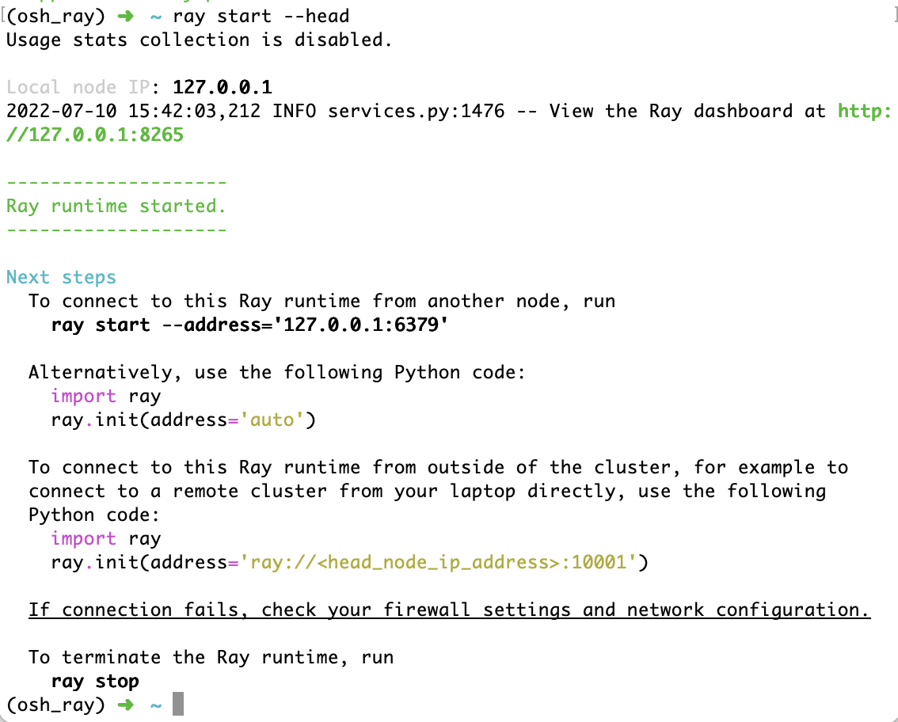
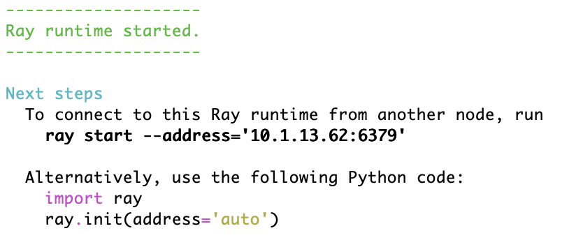
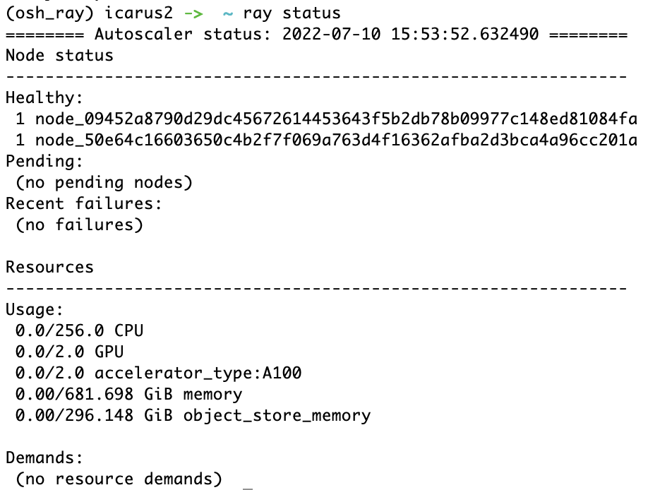

# LAB4：Ray 部署文档

## 单机部署

首先下载安装 Ray Core。使用 conda 虚拟环境是非常方便、清洁的方法。为了与 docker 镜像提供的 python 版本对应上，需要用 conda 独立安装 3.7.7 版本的 python。

```shell
conda create -n osh_ray python=3.7.7
conda activate osh_ray
pip install 'ray[default]'
```

完成安装后，通过以下命令即可启动 Ray 服务器：

```shell
ray start --head
```



也可以不单独启动 Ray 服务器，而是从 python 代码中直接调用 `ray.init()` 方法来临时启动 Ray 运行时环境。

有了 Ray 服务器在后台运行后，可以打开对应链接查看 dashboard。

在 python 代码中，使用以下命令连接到已经在本机运行的 Ray 服务器：

```python
ray.init(address='auto')
```

随后提交的计算任务全部由 Ray 服务器处理。


## 分布式部署

要让不同机器上运行的 Ray 进程能够互相通信并共享计算资源，最方便的方式是让这些机器全部处于同一个内网，否则需要处理比较繁琐的端口映射（仅映射单个端口并不能让 ray 成功连接）。因此这里选用处在同一个内网中的两台服务器进行分布式部署。

在每台服务器上，使用与单机部署相同的方式配置好 Ray 的基础环境。随后在一台机器上先运行以下指令，启动头节点：

```shell
conda activate osh_ray
ray start --head
```

Ray 会输出连接到头节点的指令提示，例如：



在其他机器上执行如下指令来连接。

```shell
conda activate osh_ray
ray start --address='10.1.13.62:6379'
```

在任一节点上输入 `ray status` 来查看集群状态：




## 基于 Docker 的分布式部署

由于前文所述的网络连接问题，这里建议千万不要使用 Docker Desktop 来给自己找麻烦。最方便的方法依旧是在 Linux 上使用 docker，并通过 `--network=host` 选项来规避端口映射的麻烦。

拉取镜像：

```shell
docker pull rayproject/ray
```

启动容器：

```shell
docker run -it --network=host rayproject/ray
```

进入容器后，使用与上一步相同的 Ray 命令来启动 Ray 服务。

在头节点上：

```shell
ray start --head
```

在其他节点上：

```shell
ray start --address='10.1.13.62:6379'
```

就能启动 Ray 集群。


由于 Docker 环境不方便进行开发，往往需要从计算节点外部连接到 Ray 服务器。先在本机上做一个端口映射：

```shell
ssh -L 10001:localhost:10001 -N <Ray 头服务器的 ip>
```

再在本机上编写程序，通过如下 python 代码即可连接到远程 Ray 服务器。

```python
ray.init(address='ray://localhost:10001')
```

