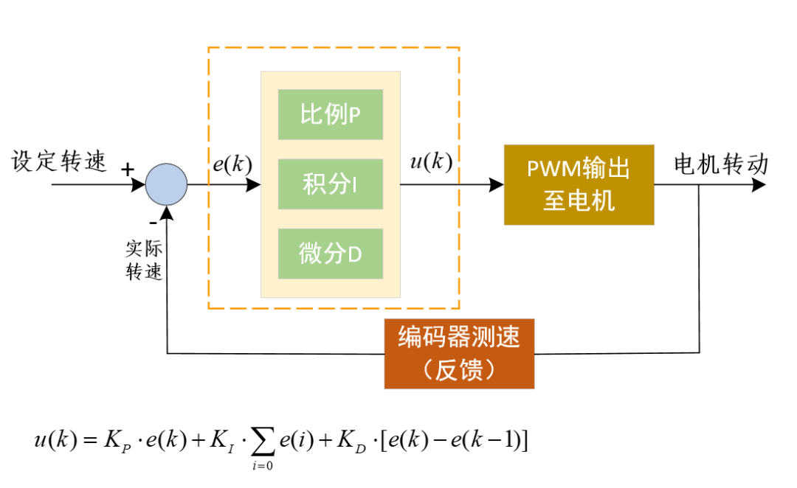
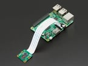

# 可行性报告

## 目录

- [可行性报告](#可行性报告)
  - [目录](#目录)
  - [项目综述](#项目综述)
  - [理论依据](#理论依据)
    - [5G技术](#5g技术)
    - [实时操作系统](#实时操作系统)
    - [控制技术方法](#控制技术方法)
      - [PID](#pid)
      - [神经网络](#神经网络)
  - [技术依据](#技术依据)
    - [PID控制](#pid控制)
      - [PID速度控制](#pid速度控制)
      - [PID位置控制](#pid位置控制)
    - [硬件资源](#硬件资源)
      - [计算设备](#计算设备)
        - [树莓派](#树莓派)
        - [单片机](#单片机)
      - [车辆](#车辆)
        - [RoboMaster](#robomaster)
        - [RC-Car](#rc-car)
      - [摄像头](#摄像头)
        - [Raspberry Pi Camera Module(PiCam)](#raspberry-pi-camera-modulepicam)
      - [雷达](#雷达)
    - [实时操作系统](#实时操作系统-1)
      - [FreeRTOS](#freertos)
      - [NuttX](#nuttx)
      - [Real-Time Linux](#real-time-linux)
    - [多机调度算法](#多机调度算法)
    - [建模与仿真模拟](#建模与仿真模拟)
      - [建模](#建模)
      - [预仿真](#预仿真)
      - [仿真平台](#仿真平台)
        - [CarSim](#carsim)
        - [大疆实验平台](#大疆实验平台)
        - [其他可选项](#其他可选项)
  - [技术路线](#技术路线)
    - [硬件控制](#硬件控制)
    - [网络连接与波动处理](#网络连接与波动处理)
    - [云端协同控制](#云端协同控制)
    - [优化与对比](#优化与对比)
  - [参考资料](#参考资料)

## 项目综述

我们所处的时代科技空前繁荣，发展异常迅猛。新一轮科技革命和产业变革方兴未艾，以互联网、物联网、大数据、云计算、人工智能为代表的新一代信息科学与技术发展日新月异，并加速向各领域广泛渗透。作为社会发展重要的引擎的交通运输领域自然成为了各种高新科技大展身手的地方。例如，汽车导航系统、交通信号灯控制系统、自动车牌识别系统、公路气象信息系统、物流和仓储自动化技术等极大地改善了乘客交通运输体验和工业生产效率。基于上述思考，我们本次的项目的大领域是智能交通。

经过初步调研，我们发现了智能交通领域存在一些不足。目前在智能公路与安全辅助驾驶层面做出的尝试往往局限于对单一车辆的运行进行决策控制，而**缺乏统一调度**。此外，现有智能交通系统中，每个运行的终端往往至多充当传感器的功能（例如上传车辆信息），而**不是可控制理终端**。因此，我们希望对多个物理终端的实时沟通和调度问题做出尝试，通过全局视角，将交通系统作为一个有机整体进行集中调度，发掘整个交通系统最大的潜能。在这一探索的过程中，由于二维多重实时性的存在——底层硬件控制系统的实时性以及全局系统调度的实时性，实时操作系统将是一个至关重要的环节。

总结一下，本项目旨在基于实时操作系统技术，借助仿真模拟平台和高还原度的可编程车辆，对多个物理终端的**实时沟通和调度问题**进行探索，并希望以此作为对万物互联纪元智能交通系统的重要课题——多运载终端实时沟通和协同课题的一次积极实践。

## 理论依据

### 5G技术

5G时代的到来，是我们立项的一个不可缺少的大前提，即：5G技术所拥有的高带宽、低时延、海量设备传输、高密度微基站技术等特性。
- 高带宽：通过实验可知，在28GHz这一频段之中，5G的数据传输速度可以达到每秒钟1Gb，其最远的传输覆盖距离可以达到2000米。由此可见，5G通信技术的出现，让V2X等依赖于通信和移动网络传输性能的技术得到极大的提升。它使得通信效率和宽带容量增强，同时也显著提升了移动网络的可靠性和稳定性，更便于对于信息纷繁的复杂环境的快速响应。
- 低时延：5G技术将传输时延降低至接近零的水平，实际测试时延在3毫秒左右，而人类的反应时间为100-200毫秒之间。因此即使有大量数据交互的情况下，依然可以保持远超人类的极高的反应速度。
- 多设备传输：5G技术具备海量的设备接入能力，使得V2X可以将更多数据设备纳入到整个无人驾驶系统中，甚至在将来每一辆车都可以和数公里范围内的交通信号灯、其他车辆、行人手机、信号基站组成神经网络，使得汽车自主选择最优行驶路线，保证行驶一路绿灯。
- 高密度微基站技术：5G采用的是高密度微基站技术，因此通讯覆盖更加全面，数据通讯更加稳定，同时原先的基站定位技术也将变得更加精准。
> V2X (Vehicle To Everything) 无人驾驶汽车的一项关键技术，它使得车辆可以通过网络与其他车辆、路面设施（信号灯、基站、RSU等）相互连接，将原本单一的智能车辆接入到整体网络中，使得汽车在行驶过程中可以根据外部信息及时作出反馈。

### 实时操作系统

实时操作系统（Real-time operating system, RTOS），又称即时操作系统，它会按照排序执行、管理系统资源，并为开发应用程序提供一致的基础。

在本项目中，与电机、传感器等设备交互时，为了达到最佳的控制精度和采样率等，对操作系统的延迟要求十分苛刻。实时操作系统相较于通用操作系统，能够保证一个任务能在需要执行时立刻执行，不会有较高的延迟，从而保证快速响应和精准控制。

选择实时操作系统部署还有以下依据：
* 多路性。实时信息处理系统与分时系统一样具有多路性。分时系统按分时原则为多个终端用户服务；而对实时控制系统，其多路性则主要表现在经常对多路的现场信息进行采集以及对多个对象或多个执行机构进行控制。
* 及时响应：实时控制系统的及时性，是以控制对象所要求的开始截止时间或完成截止时间来确定的，一般为秒级、百毫秒级直至毫秒级，甚至有的要低于100微秒。
* 高可靠性：实时系统要求系统高度可靠。因为在工业场景下，任何差错都可能带来巨大的经济损失甚至无法预料的灾难性后果。因此，在实时系统中，采取了多级容错措施来保证系统的安全及数据的安全。


### 控制技术方法

#### PID

PID控制器（比例-积分-微分控制器），由比例单元（Proportional）、积分单元（Integral）和微分单元（Derivative）组成。可以透过调整这三个单元的增益来调定其特性。PID控制器主要适用于基本上线性，且动态特性不随时间变化的系统。

PID控制器是一个在工业控制应用中常见的反馈回路部件。这个控制器把收集到的数据和一个参考值进行比较，然后把这个差别用于计算新的输入值，这个新的输入值的目的是可以让系统的数据达到或者保持在参考值。PID控制器可以根据历史数据和差别的出现率来调整输入值，使系统更加准确而稳定。

PID控制器的比例单元(P)、积分单元(I)和微分单元(D)分别对应目前误差、过去累计误差及未来误差。若是不知道受控系统的特性，一般认为PID控制器是最适用的控制器[2]。借由调整PID控制器的三个参数，可以调整控制系统，设法满足设计需求。

PID是经典的闭环控制算法，具有原理简单，易于实现，适用面广，控制参数相互独立，参数的选定比较简单等优点。本项目中我们需要稳定一些小车运动的“物理量”，（如转速），使用PID进行闭环控制是较为合适的。

#### 神经网络

神经网络是利用大量的神经元按一定的拓扑结构和学习调整方法。它能表示出丰富的特性：并行计算、分布存储、可变结构、高度容错、非线性运算、自我组织、学习或自学习等。神经网络经过各种训练，其参数设置可以达到满足控制所需的行为，可作为万能逼近器解决非线性问题，并应用到控制器设计中。

由于神经网络具有强大的建模能力，并且本项目中我们将重点使用计算资源较为充足的云端下达控制指令，因此本项目可以将神经网络引入到云端，优化对小车的控制。

## 技术依据

### PID控制

#### PID速度控制

PID速度控制的目标是控制电机达到一个稳定的转速。可以采用位置式PID和增量式PID两种方式实现。项目中计划采用增量式PID。

增量式PID算法有以下一些优点：
1. 误动作时影响小，必要时可用逻辑判断的方法去掉出错数据。
2. 手动/自动切换时冲击小，便于实现无扰动切换。当计算机故障时，仍能保持原值。
3. 算式中不需要累加。控制增量$Δe(k)$的确定仅与最近3次的采样值有关。

增量式PID控制的示意图如下。其中,$P=e(k)-e(k-1), I=e(k), D=e(k)-2e(k-1)+e(k-2)$。

伪代码如下。
``` python
//增量式PID（伪代码）
previous02_error = 0; //上上次偏差
previous01_error = 0; //上次偏差
integral = 0; //积分和
pid_out = 0; //pid增量累加和
loop:
    error = setpoint − measured_value;  /*误差项：目标值-测量值*/
    proportion = error - previous01_error;                            /*比例项：误差项-上次偏差*/
    integral = error * dt;                                            /*积分项：误差项的累计*/
    derivative = (error − 2*previous01_error + previous02_error) / dt;/*微分项：上次误差与上上次误差的变化率*/
    /*或写成：derivative = ( (error − previous01_error)/dt - (previous01_error - previous02_error)/dt )*/
    pid_delta = Kp × error + Ki × integral + Kd × derivative; //计算得到PID增量
    pid_out = pid_out + pid_delta; //计算最终的PID输出

    previous02_error = previous01_error; //更新上上次偏差
    previous01_error = error; //更新上次偏差
    wait(dt); //等待固定的计算周期
    goto loop;
```

#### PID位置控制

PID位置控制的目标是实现对电机位置的控制。原理图与上述PID速度控制相似。控制的流程如下伪代码所示。通过编码器的反馈数值进行PID运算，并最终得到对电机的控制信号。
``` 
void AutoReloadCallback()
{
	static __IO int encoderNow = 0;    /*当前时刻总计数值*/
	static __IO int encoderLast = 0;   /*上一时刻总计数值*/
	int encoderDelta = 0; /*当前时刻与上一时刻编码器的变化量*/
	int res_pwm = 0; /*PID计算得到的PWM值*/

    /*读取编码器的值*/
    encoderNow = read_encoder() + EncoderOverflowCnt*ENCODER_TIM_PERIOD;/*获取当前的累计值*/
    encoderDelta = encoderNow - encoderLast; /*得到变化值*/
    encoderLast = encoderNow;/*更新上次的累计值*/

    res_pwm = pwm_val_protect((int)PID_realize(encoderNow));/*传入编码器的[总计数值]，实现电机位置控制*/

    /*PWM控制电机*/
    set_motor_rotate(res_pwm);

    set_computer_value(SEND_FACT_CMD, CURVES_CH1, &encoderNow, 1); /*给通道1发送实际的电机位置值*/
}
```

### 硬件资源

#### 计算设备

##### 树莓派

树莓派是一个 arm 架构的机器，约是一张银行卡大小。树莓派上搭载了无线网络和蓝牙模块，不需要特殊配置。同时树莓派有 GPIO 接口，这些接口中共有 4 个硬件 PWM 接口，可以以一定的占空比输出电压脉冲，以达到自由控制平均输出电压的目的。其余的 GPIO 接口也可以用软件实现 PWM，但性能有一定局限。

树莓派价格较为便宜，而且校内有较多的存货。因此，树莓派可以轻松且大量获取。同时树莓派可以运行Linux系统，可以兼容很多的软件
，方便使用。

##### 单片机

单片机，全称单片微型计算机（single-chip microcomputer），又称微控制器单元（microcontroller unit），是把中央处理器、存储器、定时/计数器（timer/counter）、各种输入输出接口等都集成在一块集成电路芯片上的微型计算机。

与应用在个人电脑中的通用型微处理器相比，它更强调自供应（不用外接硬件）和节约成本。它的最大优点是体积小，可放在仪表内部，但存储量小，输入输出接口简单，功能较低。

单片机通常是哈佛结构的。运行的程序只能通过计算机烧写的方式改变：通过专用编程软件，将高级语言转化成指令序列，烧写到单片机的程序存储器中。单片机通常不运行通用操作系统，而是直接运行用户程序，或是通过实时操作系统来运行用户程序。如果在单片机上运行实时操作系统，其实时性有很好的保障，可以用单片机来操作硬件。因此，本项目计划在单片机上借助实时操作系统控制硬件。

市面上单片机种类繁多，比如Arduino-uno, 树莓派 Pico, STM32等等。其中stm32是成熟的单片机解决方案，有很多功能不同的型号可以选，价格从几十到上百不等。我们在项目中可以按需选择。

#### 车辆

在现实的智能交通场景中，交通运输工具种类繁多，性能各异。为了更加贴近智能交通的场景，本项目中我们将采用不同种类的车辆，并在系统设计时既考虑车辆的共性，又兼顾车辆的个性，以设计更好的调度系统。

##### RoboMaster

RoboMaster有EP和S1两款主要的产品。这里以S1为例进行简单介绍。DJI RoboMaster S1 是 DJI 于 2019 年 6 月 11 日推出的“智能教育机器人”[14]，是 RoboMaster 系列消费级地面无人机的首款产品，旨在将机器人技术引入幼儿。在2019年RoboMaster机器人大赛期间大力推广，成为大赛的非官方吉祥物。

S1（意为“Step 1”）是一款类似赤壁坦克的漫游车，通过 Wi-Fi 和 Microsoft Windows、Apple iOS 和 Google Android 移动设备上的应用程序进行远程控制。S1具有弹簧阻尼梁轴前悬架、四个允许全方向灵活扫射的 12 滚轮麦克纳姆轮、安装在 2 轴云台炮塔“头部”内的 1080p FVP 摄像头，以及通过红外光束照明器“对抗”其他 S1 装置的能力。

选用RoboMaster S1车辆的依据如下：
1. S1开箱即用，提供了比较完整的接口，可以使用 Scratch 和 Python 以及软件模块进行编程，编程门槛不高。
2. S1生态较为健康，支持文档详细全面。
3. 实验室可以获取到实体平台。目前小组已经从老师那里预定了一台。
4. 大疆实验平台可以提供较为成熟的仿真支持。

目前，我们找到了一些小车的接口。链接如下[DJI Python API List](https://github.com/program-in-chinese/overview/wiki/大疆Python-API列表) 与 [S1-ap(dji.com)](https://bbs.dji.com/forum.php?mod=viewthread&tid=227127)。

##### RC-Car

遥控车(RC-car), 是无线电或红外线等无线操控的方式控制的玩具车或模型车。遥控车的控制信号通过手摇杆上的发射器发出，由装在车上的接收器接收。接收器根据接收到的射频信号控制车速、改变车轮的转动方向以及马达、伺服马达或引擎的运转。

RC-car的控制器等部件可以和树莓派的GPIO接口相连，这样就可以通过树莓派控制RC-car。下面简单介绍一下具体的实现方案。

当硬件接线完成后，可以进行如下设置。首先，将 PIGPIO daemon设置为始终在启动时运行
``` bash
sudo systemctl enable pigpiod & sudo systemctl start pigpiod
```
接着，编辑myconfig.py文件。对于RC输入，将其选择myconfig.py中的控制器类型，并取消遥感控制。
``` bash
CONTROLLER_TYPE = 'pigpio_rc'
USE_JOYSTICK_AS_DEFAULT = True
```
之后，PIGPIO RC Control提供了如下的输入选项。通过这些选项我们可以控制RC-car。
``` bash
#PIGPIO RC control
STEERING_RC_GPIO = 26
THROTTLE_RC_GPIO = 20
DATA_WIPER_RC_GPIO = 19
PIGPIO_STEERING_MID = 1500         # Adjust this value if your car cannot run in a straight line
PIGPIO_MAX_FORWARD = 2000          # Max throttle to go fowrward. The bigger the faster
PIGPIO_STOPPED_PWM = 1500
PIGPIO_MAX_REVERSE = 1000          # Max throttle to go reverse. The smaller the faster
PIGPIO_SHOW_STEERING_VALUE = False
PIGPIO_INVERT = False
PIGPIO_JITTER = 0.025   # threshold below which no signal is reported
```

从上面的选项可以看出，RC-car可以提供比RoboMaster更为底层的硬件接口。当然，选用RC-car作为本项目中的车辆也是比较可行的。

市面上有很多RC-car供我们选择，在淘宝上有不少RC-car可以购买，价格几百元左右。不少RC-car外形炫酷，适合展示。如果我们选用内燃机的RC-car, 还可以更加真实地模拟现实中的汽车。

#### 摄像头

##### Raspberry Pi Camera Module(PiCam)

PiCam能与树莓派自然对接，即在配置的过程中不需要修改myconfig.py，可以节省我们配置的时间。

比较推荐的一款产品是Raspberry Pi Camera Board v2 - 8 Megapixels。这是一款高品质 8 兆像素 Sony IMX219 图像传感器，是为 Raspberry Pi 定制设计的附加板，具有定焦镜头。它能够处理 3280 x 2464 像素的静态图像，还支持 1080p30、720p60 和 640x480p90 视频，价格在30美元左右。



#### 雷达

光学雷达，或称光达或激光雷达（lidar, 是英文“light detection and ranging”的缩写），是一种光学遥感技术，它通过向目标照射一束光，通常是一束脉冲激光来测量目标的距离等参数。

利用雷达作为传感器，我们可以在较暗的环境下实现对小车的自动控制，而这是仅靠摄像头难以实现的。此外，雷达能对周围空间进行较好的3D建模，这样小车的位置、轨迹就能得到更精准地刻画。如果将雷达和摄像头结合起来，我们可以采用Machine Learning, LiDAR-based SLAM(Simultaneous Localization and Mapping)等方法来对小车进行导航。因此，借助雷达我们可以开发小车更多的功能，如智能避障等。

雷达属于精密仪器，价格从上千到数万都有。如果预算充分的话，可以考虑Velodyne Lidar、 Ouster OS1 Lidar等型号。

### 实时操作系统

硬性指标如下：

FreeRTOS 和 NuttX 都能做到 几十微秒 级别的延迟控制。实时 Linux 能做到 一百微秒 级别的延迟控制。

FreeRTOS 和 NuttX 可以运行在 STM32 上作为硬件控制器，但较难部署到树莓派3B上，因为需要移植工作量较大。

实时 Linux 只能运行在树莓派3B上，但我们不考虑使用树莓派来直接控制马达。如果要求树莓派要与 STM32 保持超低延迟通信或是有其他低延迟需求的话，可能需要采用。

#### FreeRTOS

FreeRTOS 是业界最流行的实时操作系统，主要针对微控制器和小型的微处理器。FreeRTOS 的核心代码十分精简，并搭配大量的库代码以适应工业界的各种需求。

在 FreeRTOS 上编程时，程序员通过定义 task 并指定其优先级等参数来创建进程。内核会自动调度所有的进程。FreeRTOS 还提供了任务控制的 API，每个 task 可以通过函数调用来控制自己的运行状态（如延迟执行、设定在一定时间后唤醒等）。通过这些 API 可以完成灵活的实时任务调度。

FreeRTOS 的核心代码较为精简，移植到不同微控制器上的难度不大，大多数情况下只需要修改一些外设的接口信息即可。FreeRTOS 官方支持 STM32 和 树莓派 Pico，暂时没有树莓派3B的官方支持。如果我们使用 STM32 单片机来控制小车的轮毂电机，那么部署 FreeRTOS 时不需要任何额外的移植工作。

#### NuttX

NuttX 是一款强调标准兼容性和小体积的实时操作系统。NuttX 提供大量可选的功能支持，包括但不限于文件系统、网络、蓝牙设备支持；如果不需要，可以在编译时进行裁剪。

NuttX 兼容 POSIX 标准，因此程序员并不需要接触底层来完成许多硬件交互，而是可以直接使用 POSIX 系统调用。这提供了良好的代码迁移灵活度，能够减少开发成本，例如 Linux 下编写的程序可以非常容易地迁移至 NuttX 下运行。也因此，NuttX 上可以运行 shell，可以动态加载外接存储上的可执行文件，功能非常灵活。

NuttX 也提供一些独有的或是从其他实时操作系统中借鉴来的系统调用用于管理进程的行为。

相对 FreeRTOS 来说，资源占用会更多，尤其是内存使用。

#### Real-Time Linux

大多数的实时操作系统都是专门针对微控制器设计的。树莓派作为一个完整的 PC 硬件体系，并不是微控制器，但因其同样具有一定程度的硬件交互能力，有时也需要在树莓派上运行实时操作系统。此时可以选用实时 Linux 内核。

通过给主线 Linux 内核添加 PREEMPT_RT 补丁，可以将 Linux 的内核变为完全可被抢占的 (fully preemptible)，从而将 Linux 内核变为**实时内核**，拥有比主线可抢占式内核 (PREEMPT) 更高的实时性。

Linux 内核提供的若干种调度策略中， FIFO、RR、DEADLINE 这三种属于实时调度策略，已经被合并入主线。实时内核在执行上述三种调度策略时具有更高的实时性，能够达到实时控制硬件的延迟要求。在树莓派 4B 上测试，主线内核的最大延迟达到了 301 µs，而实时内核的最大延迟仅为 93 µs。

部署较为简单，只需要给内核代码打上补丁之后重新编译即可。

近几年，PREEMPT_RT 补丁一直在努力合并入主线内核。2021 年 8 月，补丁的核心部分已经大部分被合并。截至此文书写时（2022.4.19，Linux 5.18），合并尚未完成。

### 多机调度算法

自动驾驶的实现需要大量车载传感器的支持，然而，在有限车载计算资源条件下，由传感器所产生的庞大数据量使得自动驾驶任务的实时性难以满足，这成为阻碍自动驾驶技术进一步发展的重要阻力。将驾驶任务进行协作处理和统一调度并充分利用多个协作车辆的计算资源以及云端的计算资源是解决上述问题的一种途径。为了更好地协同系统中的车辆，项目中需要引入云端服务器。在服务器中，自然也就需要像操作系统中的进程调度算法的多机调度算法。

### 建模与仿真模拟

#### 建模

首先，我们希望模型能够尽可能地贴近真实的物理实体，从这一点出发我们考虑根据硬件来选用最合适的仿真平台，其中会包含有较为详尽的模型参数，并且平台的选择会有更明确的导向型和适配性。
其次，如果上述思路与我们的实际需求难以匹配，则考虑寻找尽可能相似的模型，最后再考虑使用软件搭建模型，如：采用solidworks手动搭建，后续也可请第三方定制事物模型。因为这一步骤并不是我们项目探究的重点，所以要争取用最少的精力，获取最好的模型以及效果，为后续的仿真操作奠基。
这一工作较为容易，并且考虑好了多种备选方案。

#### 预仿真

 
[Simulink平台](https://ww2.mathworks.cn/solutions/automated-driving.html)

使用 MATLAB 和 Simulink，我们可以开发路径规划和控制算法。可以使用横向和纵向控制器设计车辆控制系统，使自主驾驶终端能够遵循规划的轨迹，使用传感器模型和车辆动力学模型，在二维和三维仿真环境中合成式地测试算法，伴随轨迹的仿真检验其效果。

#### 仿真平台

##### CarSim
[[Link]](https://www.carsim.com/products/carsim/) 是 Mechanical Simulation 公司开发的强大的动力学仿真软件，被世界各国的主机厂和供应商所广泛使用。 CarSim 针对四轮汽车，轻型卡车，符合我们的设计面向对象，其有着多方面的优越性，使得成为**较为中意**的仿真平台。
- **CarSim 模型在计算机上运行的速度可以比实时快 10 倍，模拟结果高度逼近真实车辆。** 可以仿真车辆对驾驶员控制， 3D 路面及空气动力学输入的响应， 主要用来预测和仿真汽车整车的操纵稳定性、 制动性、 平顺性、 动力性和经济性。 
- **CarSim 自带标准的 Matlab/Simulink 接口， 可以方便的与 Matlab/Simulink 进行联合仿真**， 用于控制算法的开发。
- **同时在仿真时可以产生大量数据结果用于后续使用 Matlab 或者 Excel 进行分析或可视化。** 
- CarSim 同时提供了 **RT 版本**， 可以支持主流的 HIL 测试系统， 如 dSpace 和 NI 的系统， 方便的联合进行 HIL 仿真。

##### 大疆实验平台
[[Link]](https://www.dji.com/cn/edu-hub?site=brandsite&from=nav) 总体推荐，内含由大疆开发的仿真软件，能够提供准工业级仿真、丰富应用场景并且拥有较为成熟且健康的生态，总结优势如下 
- 实验室有容易获取的实物平台（S1系列机器人）；
- 支持图形化界面编程，Python编程；
- 能够提供准工业级的仿真和丰富的应用场景；
- 生态较为健康，并且文档支持很齐全；
- 接口完整（S1和EP系列均是）：

Related Links：[DJI Python API List](https://github.com/program-in-chinese/overview/wiki/大疆Python-API列表) and [S1-ap(dji.com)](https://bbs.dji.com/forum.php?mod=viewthread&tid=227127)
​
##### 其他可选项
Unity、华为自动驾驶云服务 Octopus、SUMO、Cognata、Apollo、 AirSim等。

## 技术路线

我们按照大致的时间先后顺序列出我们的技术路线。

### 硬件控制

硬件控制的目的是让小车能动起来，这一部分计划占用项目20%左右的时间。

1. 在获取到可用的硬件资源后，阅读产品的相关手册并对实体进行组装（如将摄像头模块加装到树莓派上，将小车与stm及树莓派相连）。之后，测试产品的接口是否符合需求。
2. 实现基于指令的高可靠性和高实时性的小车控制。利用实时操作系统和PID控制等技术，实现对控制信号的实时处理，并生成实时性好、精确度高、可靠性强的电机信号。
3. 实现自主独立高安全性的小车控制。在上层服务器故障或者是网络延迟较大的情况下，实时性将会难以保证，此时小车将会切换到自主控制模式。在该模式下，小车将实现巡航、智能避障以及自主停车等功能，最大限度保障安全性。

### 网络连接与波动处理

这一部分实现的技术要点是将小车搭建为万物互联网络中的一环，使其能受服务器控制，并探索网络波动问题的相关解决方案。具体路线如下：

1. 完成硬件控制的相关工作后，利用树莓派将小车接入互联网。验证小车可以通过网络进行远程控制与数据上传。
2. 初步搭建服务器上的实时操作系统，探究不同的网络条件（如网络延迟大小）以及实时级别不同的实时操作系统对小车运行的影响。
3. 根据上一步得出的结果，选择能达到计算效率与实时性能平衡的实时操作系统，并确定小车的网络波动允许的阈值。
4. 设计应对网络波动的处理方案。初步设想是，当网络波动达到阈值后，将小车切换为自主控制模式，让其安全运行，同时需要实时监控网络状况，确保网络恢复时服务器能及时再次控制小车。
5. 设计针对单一小车的服务器端智能实时控制系统。这一系统接收小车的硬件（摄像头、雷达等）传递的信息，并对其进行加工和处理。之后，系统通过神经网络、机器学习等工具生成小车的控制信号并传递给小车。

### 云端协同控制

这一部分实现的技术要点是基于云端的多终端协同控制。

1. 部署复杂度$O(1)$的多终端协同调度算法。
2. 尝试让小车以给定的周期（如每10s运行一周）运行，勾画出给定的复杂的图案（比如一辆小车做圆周运动，其它小车在圆内通过轨迹勾画三角形、五角星等形状）。根据实际调整多机调度算法。

### 优化与对比

最后一个阶段，我们将对整个模拟智能交通系统进行全面系统的优化与性能评估。考虑从以下几个方面入手：

1. 通过深度学习等手段优化云端的调度算法。
2. 探究减小网络时延的方法。
3. 探究异常情况的处理。研究小车轮胎突然打滑、小车之间发生了相互碰撞的情况下如何进行合理地调度。
4. 探究不同的实时操作系统（如FreeRTOS、Nuttx、Linux)部署后的性能。尝试优化上层调度控制和底层硬件控制的实时性。

## 参考资料

1. [FreeRTOS context switch implementation](https://www.freertos.org/implementation/main.html)
2. [Microcontrollers and compiler tool chains supported by FreeRTOS](https://www.freertos.org/RTOS_ports.html)
3. [FreeRTOS - Porting a FreeRTOS demo to a different hardware platform](https://www.freertos.org/porting-a-freertos-demo-to-different-hardware.html)
4. [SMP Demos for the Raspberry Pi Pico Board - FreeRTOS](https://www.freertos.org/smp-demos-for-the-raspberry-pi-pico-board.html)
5. [FreeRTOS-SMP-Demos/FreeRTOS/Demo/CORTEX_M0+_RP2040 at main · FreeRTOS/FreeRTOS-SMP-Demos (github.com)](https://github.com/FreeRTOS/FreeRTOS-SMP-Demos/tree/main/FreeRTOS/Demo/CORTEX_M0%2B_RP2040)
6. [Raspberry Pi 4B: Real-Time System using Preempt-RT (kernel 4.19.y) - LeMaRiva Tech](https://lemariva.com/blog/2019/09/raspberry-pi-4b-preempt-rt-kernel-419y-performance-test)
7. 《2021中国自动驾驶仿真研究报告》
8. 《中国无人驾驶仿真技术蓝皮书2020》
9. [PID速度控制](https://cloud.tencent.com/developer/article/1838745#:~:text=PID%E5%8D%B3%EF%BC%9AProportional%EF%BC%88%E6%AF%94%E4%BE%8B%EF%BC%89,%E9%83%BD%E4%BC%9A%E6%B4%BE%E4%B8%8A%E5%A4%A7%E7%94%A8%E5%9C%BA%E3%80%82)
10. [PID位置控制](https://mp.weixin.qq.com/s?__biz=MzUyNzkzMzAxNw==&mid=2247485801&idx=2&sn=0990725af352baa366defa919e5834d7&chksm=fa79425fcd0ecb4909516fd87a54b840775bd9449ecd88c6728c8d17221a72073b1660748e70&scene=178&cur_album_id=1734196262800818182#rd)
11. [PiCam](https://www.adafruit.com/category/802)
12. [Velodyne Lidar](https://velodynelidar.com/products/puck/)
13. [RC Car ML Model Development with an Ouster OS1 Lidar](https://www.wilselby.com/2020/02/rc-car-ml-model-development-with-ouster-os1-lidar/)
14. [PID](https://en.wikipedia.org/wiki/PID_controller)
15. [Nvidia Jetson Products](https://developer.nvidia.com/buy-jetson)
16. [Donkey Car](https://docs.donkeycar.com/)