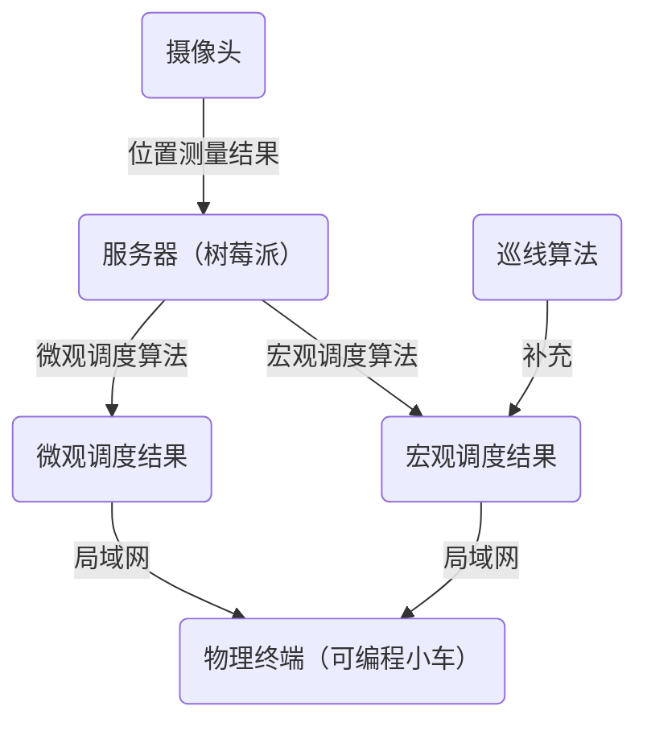
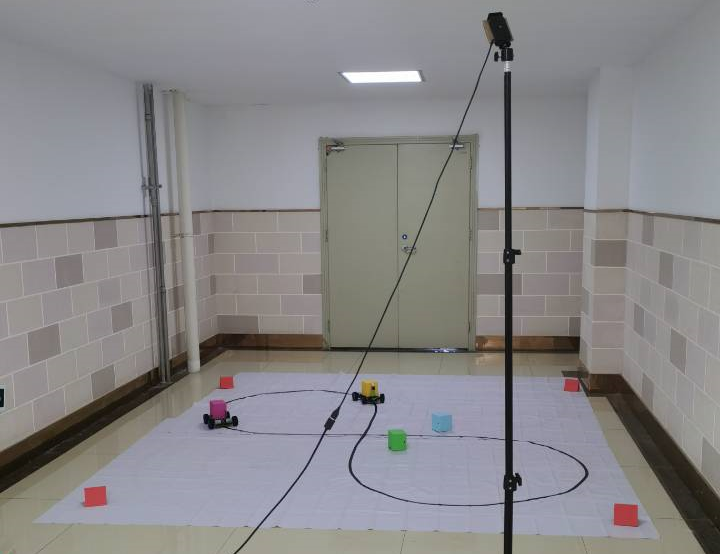
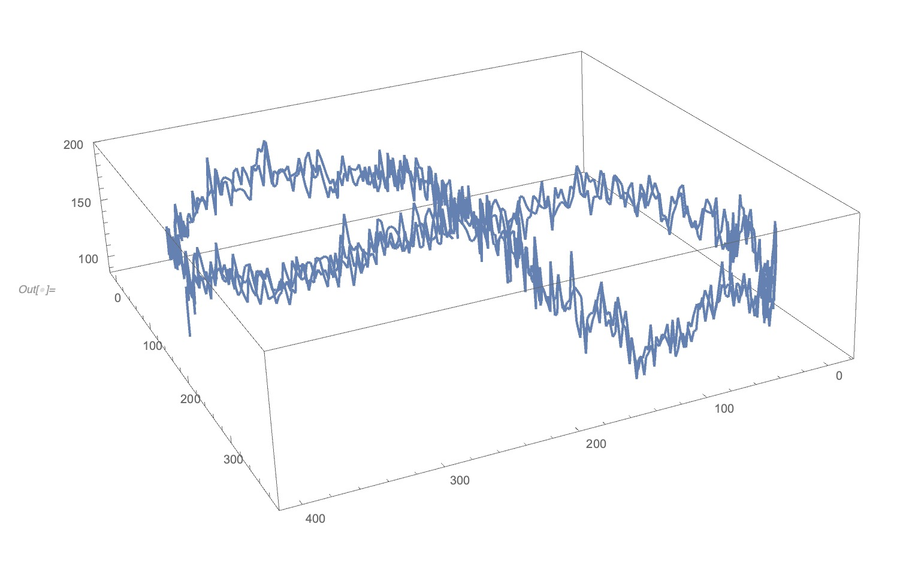
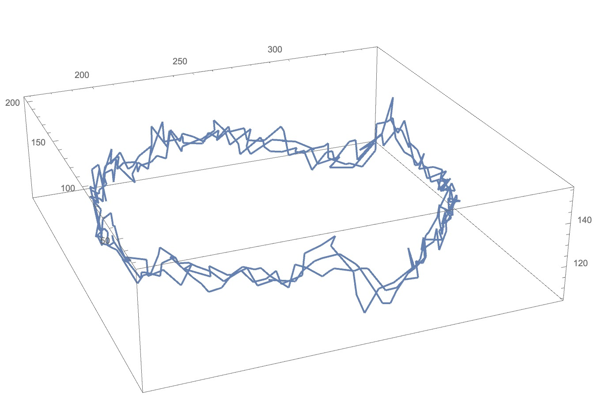
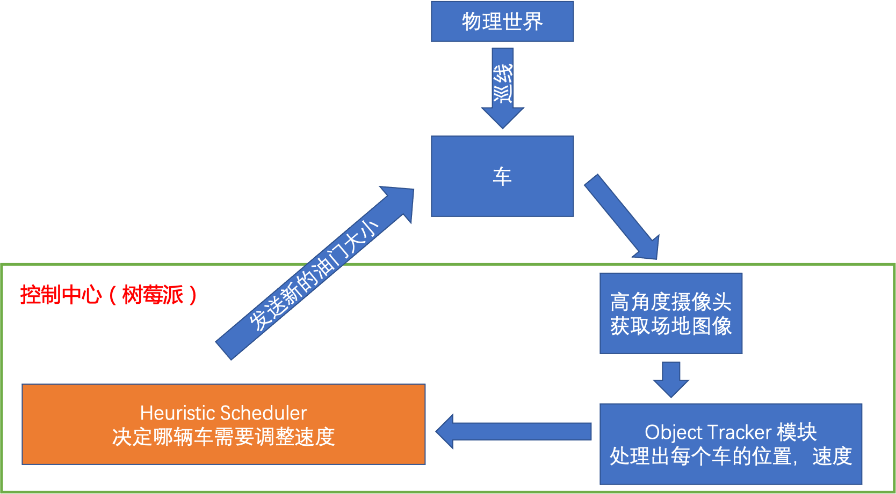
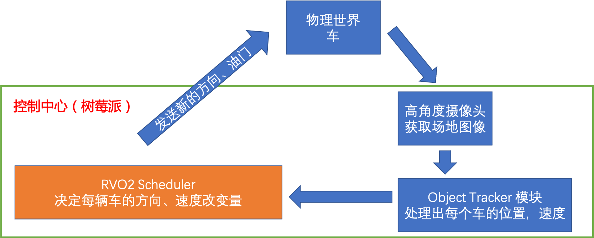
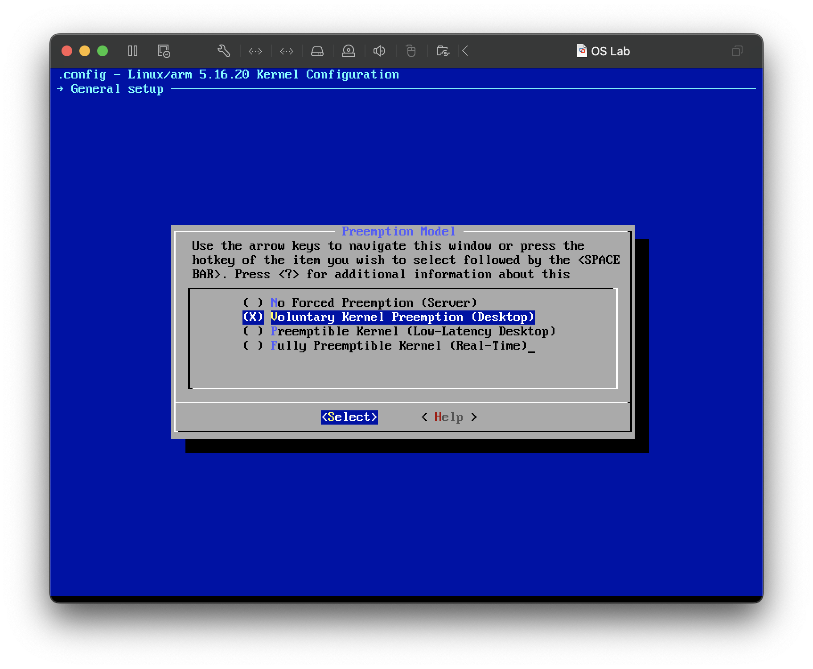
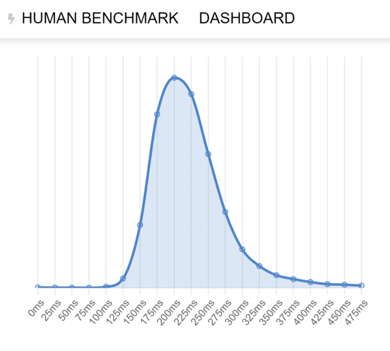

# 结题报告  x-NooBirds
- [1 项目简介](#1-项目简介)
- [2 背景和立项依据](#2-背景和立项依据)
  - [2.1 项目背景](#21-项目背景)
    - [2.1.1 智能交通系统](#211-智能交通系统)
    - [2.1.2 智能交通系统的当下与未来](#212- 智能交通系统的当下与未来)
  - [2.2 立项依据](#22-立项依据)
    - [2.2.1 实时操作系统及其优势](#221-实时操作系统及其优势)
    - [2.2.2 实验的载体：PiRacer AI Kit](#222-实验的载体：PiRacer AI Kit)
    - [2.2.3 终端调度算法](#223-终端调度算法)
- [3 项目设计细节](#3-项目设计细节)
  - [3.1 项目整体架构](#31-项目整体架构)
  - [3.2 小车位置与速度的测量](#32-小车位置与速度的测量)
    - [3.2.1 构建试验场地的平面坐标系](#321-构建试验场地的平面坐标系)
    - [3.2.2 测量小车的物理位置](#322-测量小车的物理位置)
    - [3.2.3 测量小车的物理速度](#323-测量小车的物理速度)
  - [3.3 终端巡线算法的实现](#33-终端巡线算法的实现)
    - [3.3.1 颜色处理](#331-颜色处理)
    - [3.3.2 巡线实现](#332-巡线实现)
  - [3.4 终端调度算法的实现](#34-终端调度算法的实现)
    - [3.4.1 调度算法的设计目标](#341-调度算法的设计目标)
    - [3.4.2 宏观调度算法的具体设计](#342-宏观调度算法的具体设计)
      - [沙盘推演型调度器](#沙盘推演型调度器)
      - [相对计算法调度器](#相对计算法调度器)
    - [3.4.3 微观调度算法的修改](#343-微观调度算法的修改)
    - [3.4.4 模拟模块](#344-模拟模块)
    - [3.4.5 可视化模块](#345-可视化模块)
  - [3.5 服务器的部署与工作配置](#35-服务器的部署与工作配置)
    - [3.5.1 实时 Linux 部署](#351-实时 Linux 部署)
    - [3.5.2 控制程序的设计](#352-控制程序的设计)
- [4 实验结果](#4-实验结果)
  - [4.1 超多终端的实时控制](#41-超多终端的实时控制)
  - [4.2 多终端的调度与仿真](#42-多终端的调度与仿真)
  - [4.3 精确的小车位置测量与路线规划](#43-精确的小车位置测量与路线规划)
  - [4.4 两辆小车互换位置](#44-两辆小车互换位置)
  - [4.5 两辆小车的路口防撞和道路防追尾](#45-两辆小车的路口防撞和道路防追尾)
  - [4.6 调度性能和调度质量的测量与评价](#46-调度性能和调度质量的测量与评价)
    - [4.6.1 终端安全性](#461-终端安全性)
    - [4.6.2 终端舒适性](#462-终端舒适性)
    - [4.6.3 调度公平性](#463-调度公平性)
    - [4.6.4 调度优越性](#464-调度优越性)
    - [4.6.5 调度优先性](#465-调度优先性)
- [5 总结](#5-总结)
  - [5.1 项目特色](#51-项目特色)
  - [5.2 缺陷和前景](#52-缺陷和前景)
- [参考文献](#参考文献)

## 1 项目简介

本项目旨在基于现有的实时操作系统技术，借助仿真模拟平台和高还原度的可编程车，对多个物理终端的**实时沟通和调度问题**进行解决，并希望以此作为对万物互联纪元智能交通系统的重要课题——多运载终端实时沟通和协同问题的一次积极实践。

## 2 背景和立项依据

### 2.1 项目背景

#### 2.1.1 智能交通系统

智能交通系统（Intelligent Traffic System，简称ITS）又称智能运输系统（Intelligent Transportation System），是将先进的科学技术（信息技术、计算机技术、数据通信技术、传感器技术、电子控制技术、自动控制理论、运筹学、人工智能等）有效地综合运用于交通运输、服务控制和车辆制造，加强车辆、道路、使用者三者之间的联系，从而形成一种保障安全、提高效率、改善环境、节约能源的综合运输系统。

#### 2.1.2 智能交通系统的当下与未来

当前的智能交通系统解决方案有如下特点：

- 解决的通常是宏观的道路拥堵和车流引导问题，而很少聚焦于**单一车辆的行为控制和建议**，例如：
  1. 当前的导航系统确实会提示某路段拥堵并给出建议的替代路线，但对于所有车辆的建议往往导致另一路段开始拥堵，更合理的方案应该是建议一部分车辆更改路线。
  2. 当前的智能交通系统没有对于运载终端具体行为的统一调度。
- 智能公路与安全辅助驾驶层面做出的尝试（例如自动驾驶）往往局限于决策单一车辆的运行而**缺乏统一调度**。
- 每个运行的终端往往至多充当传感器的功能（例如上传车辆信息），而**不是可控制的物理终端**。

而随着社会经济的发展与信息化进程的继续，大数据为模拟和预测未来交通状态提供了可能，云计算为庞大规模的统一运算提供了基础，而5G技术的普及，也使得交通系统中的终端各个终端得以互联。在万物互联的新纪元，智能交通系统需要做到化整为零——通过对于每一个运载终端的合理控制或建议，达到交通规划的全新高度。在未来智能交通系统的设想中，有如下特点：

- 以**控制运载终端**的方式解决宏观的道路问题；
- 超高的**实时性**和**安全性**，保证交通参与者的安全和舒适度。

### 2.2 立项依据

#### 2.2.1 实时操作系统及其优势

实时操作系统（RTOS）是指当外界事件或数据产生时，能够接受并以足够快的速度予以处理，其处理的结果又能在规定的时间之内来控制生产过程或对处理系统做出快速响应，调度一切可利用的资源完成实时任务，并控制所有实时任务协调一致运行的操作系统。提供及时响应和高可靠性是其主要特点。

实时操作系统相对于通用操作系统的优势如下：

- **多路性**。实时信息处理系统与分时系统一样具有多路性。系统按分时原则为多个终端用户服务；而对实时控制系统，其多路性则主要表现在经常对多路的现场信息进行采集以及对多个对象或多个执行机构进行控制。
- **独立性**。实时信息处理系统与分时系统一样具有独立性。每个终端用户在向分时系统提出服务请求时，是彼此独立的操作，互不干扰；而在实时控制系统中信息的采集和对对象的控制，也彼此互不干扰。
- **及时性**。实时信息系统对实时性的要求与分时系统类似，都是以人所能接受的等待时间来确定；而实时控制系统的及时性，则是以控制对象所要求的开始截止时间或完成截止时间来确定的，一般为秒级、百毫秒级直至毫秒级，甚至有的要低于100微秒。
- **交互性**。实时信息处理系统具有交互性，但这里人与系统的交互，仅限于访问系统中某些特定的专用服务程序。它不像分时系统那样能向终端用户提供数据处理服务、资源共享等服务。
- **可靠性**。分时系统要求系统可靠，相比之下，实时系统则要求系统高度可靠。因为任何差错都可能带来巨大的经济损失甚至无法预料的灾难性后果。因此，在实时系统中，采取了多级容错措施来保证系统的安全及数据的安全。

本次实验中，我们将通过部署实时操作系统，使关键进程的平均周转时间的上限以及关键进程之间的独立正常运行等设计要求得到满足。在实验的最后我们也会对实时操作系统的部署效果进行测试。

#### 2.2.2 实验的载体：PiRacer AI Kit

 遥控车(RC-car), 是无线电或红外线等无线操控的方式控制的玩具车或模型车。本次实验中采用的是 PiRacer AI Kit 遥控车，是一款专门为树莓派设计的智能型赛车车套件，基于树莓派主板。扩展板将 OLED ，电机驱动电路，电池保护电路等集成在一起，免去焊接电路的繁琐操作，能够很好地适应我们实验简化硬件的操作，仅需将零件组装到主板上即可。其控制信号通过发射终端传出，被装在车上的接收器接收。接收器根据接收到的射频信号控制车速、改变车轮的转动方向以及马达、伺服马达或引擎的运转。

PiRacer AI Kit 的执行器等部件可以通过主板和树莓派直相连，达到通过树莓派控制车辆的目的。下面简单介绍一下具体的实现方案。

当硬件接线完成后，可以进行如下设置。首先，安装所需的库：

```shell
sudo apt-get update
sudo apt-get upgrade
sudo apt-get install build-essential python3 python3-dev python3-pip python3-virtualenv python3-numpy python3-picamera 
sudo apt-get install python3-pandas python3-rpi.gpio i2c-tools avahi-utils joystick libopenjp2-7-dev libtiff5-dev gfortran 
sudo apt-get install libatlas-base-dev libopenblas-dev libhdf5-serial-dev git ntp
sudo apt-get install python3-opencv
```

接着，创建 python 虚拟环境：

```shell
python3 -m virtualenv -p python3 car_env --system-site-packages
source car_env/bin/activate
```

下载安装 Donkeycar 的 python 模块，并生成车辆控制代码：

```shell
git clone https://github.com/waveshare/donkeycar
cd donkeycar
git checkout master
pip install -e .[pi]
pip install numpy --upgrade
donkey createcar --path ~/mycar
```

校准舵机。使用以下命令，测试舵机的输入值，得到使车辆完全左转和完全右转所需要的信号值。

```shell
cd ~/mycar
donkey calibrate --channel 0 --bus=1
```

编辑车辆配置。在`~/mycar/config.py`文件中，适当修改以下的值，以得到合适的转向幅度和油门大小：

```bash
\#STEERING
STEERING_CHANNEL = 0      #channel on the 9685 pwm board 0-15
STEERING_LEFT_PWM = 200     #pwm value for full left steering
STEERING_RIGHT_PWM = 580    #pwm value for full right steering

\#THROTTLE
THROTTLE_CHANNEL = 0      #channel on the 9685 pwm board 0-15
THROTTLE_FORWARD_PWM = 4095   #pwm value for max forward throttle
THROTTLE_STOPPED_PWM = 0    #pwm value for no movement
THROTTLE_REVERSE_PWM = -4095  #pwm value for max reverse throttle
```

#### 2.2.3 终端调度算法

调度部分的主要功能是作为一个中间层与小车识别、定位、分析模块以及接近物理实体的硬件控制模块相连，控制调度整个智能交通系统，实现交通系统运行的安全性、公平性、舒适性和优先权控制等智能的功能。调度模块采用集中化调度，统一协调控制智能交通系统中的所有可以被调度器控制的车辆。调度模块的输入是每一辆小车的位置和速度，输出给小车控制模块的是调度模块建议的小车的速度。

本次实验将测试两种终端调度算法：

- **宏观调度算法**。宏观调度算法试图调整小车在街道上运行的速度，使得每一个十字路口的峰值载流量能够降低以及单一道路上的车速能保持相对一致。本次试验中，我们将提前预判小车在十字路口相撞或在单一道路上追尾的可能，并针对这两种潜在事故给出一种宏观调度算法。同时，为了提前验证算法的正确性，我们实现了一个的模拟器以验证调度算法的正确性，并为算法的开发提供回溯和支持。
- **微观调度算法**。微观调度算法试图解决小车在十字路口相遇时的路线规划问题。如果每辆小车在十字路口能不用等待交通灯地直接驶向目的地且自动规划路线，那么道路资源将得到最大化利用。在本次实验中，我们将修改现成的 RVO2 仓库进行测试。RVO2 是一个二维避障算法 ORCA 的 C++98 版本的开源实现，它具有应用于第三方应用程序的良好数据接口。用户可以指定静态的障碍物、移动控制终端和终端的推荐速度。其附带一个模拟单元，模拟结果通过一步一步地调用算法而逐步给出，且模拟器在运行时是完全可以操控并访问的。同时，这个仓库可以在支持 OpenMP 的多处理器上运行以达到模拟的并行运算。

## 3 项目设计细节

### 3.1 项目整体架构

项目的整体架构图如下图所示：



实际布置的实验场景如图所示：



### 3.2 小车位置与速度的测量

#### 3.2.1 构建试验场地的平面坐标系

我们在场地的四个角落放置了四个红色的测绘基准点，通过稳定地识别出四个基准点的位置并施加坐标变换方法可以将视频流中试验场地的部分映射为标准的二维平面。

首先是四个坐标基准点的识别，为了精确地测得四个基准点的位置，我们利用 OpenCV 提供的一系列函数，对得到的图像流进行预处理，如对图片进行模糊以去除噪音，将 RGB 格式转化为 HSV 格式以提高色彩分辨能力等。

```c++
cap >> frame;
...
// Gaussian Blur
GaussianBlur(frame, gsFrame, Size(5, 5), 0);
// convert BGR to HSV
cvtColor(gsFrame, hsv, COLOR_BGR2HSV);
```

通过在试验场地测量色块的具体颜色区间，得到试验场地的红色具体参数如下：

```c++
#define RED_LOWER_LIMIT1   Scalar(170, 100, 100)
#define RED_UPPER_LIMIT1   Scalar(180, 255, 255)
#define RED_LOWER_LIMIT2   Scalar(  0, 100, 100)
#define RED_UPPER_LIMIT2   Scalar( 10, 255, 255)
```

接着利用 OpenCV 的颜色识别得到色块掩盖层，例如下面给出的是识别图像中红色的代码。

```c++
Mat isRed(const Mat &src) {
    Mat range1, range2;
    inRange(src, RED_LOWER_LIMIT1, RED_UPPER_LIMIT1, range1);
    inRange(src, RED_LOWER_LIMIT2, RED_UPPER_LIMIT2, range2);
    return range1 + range2;
}
```

现在我们得到了仅含 true 或 false 的 bool 矩阵，这时再通过调用 OpenCV 给出的边界识别方法识别出一系列边界，选择其中包围面积最大的四个：

```C++
Mat mask = isRed(hsv);
// choose the contours
findContours(mask, contours, RETR_CCOMP, CHAIN_APPROX_SIMPLE);

if (contours.size() < 4) return false;

// sort the contours
std::sort(contours.begin(), contours.end(), areaLarger);
```

再以最小面积长方形作为匹配模式进行边界拟合，可以寻找到一系列长方形的色块，并以它们的几何中心分别作为基准点在图片上的位置：

```c++
// update location of base points
Point chosenPoints[4];
for (int idx = 0; idx < 4; idx++) {
    auto rect = minAreaRect(contours[idx]);
    Point2f rectPoints[4];
    rect.points(rectPoints);
    chosenPoints[idx] = Point(
        (rectPoints[0].x + rectPoints[1].x
       + rectPoints[2].x + rectPoints[3].x) / 4,
        (rectPoints[0].y + rectPoints[1].y
       + rectPoints[2].y + rectPoints[3].y) / 4
    );
}

// assign each chosen point
Point2f basePoints[4];
for (int idx = 0; idx < 4; idx++) {
    if (chosenPoints[idx].y < FRAME_HEIGHT / 2) {
        if (chosenPoints[idx].x < FRAME_WIDTH / 2)
            basePoints[0] = chosenPoints[idx];
        else basePoints[1] = chosenPoints[idx];
    } else {
        if (chosenPoints[idx].x < FRAME_WIDTH / 2)
            basePoints[2] = chosenPoints[idx];
        else basePoints[3] = chosenPoints[idx];
    }
}
```

最后利用OpenCV给出的视角变换函数，输入四个坐标点的位置，得到图片和坐标平面的变换矩阵。

```c++
convert = getPerspectiveTransform(basePoints, realPoints);
```

#### 3.2.2 测量小车的物理位置

我们可以此采用诸如背景减法、光流追踪和模式识别等许多种方法从图片中识别出小车。在本次试验中，为了能够稳定、高效并及时地获取小车在照片上的位置，我们决定采用色彩识别的方法识别小车的位置。这一方法是目前尝试过的所有方法中最稳定可靠的。

首先采用前面提到的色块识别的方法，并应用前面得到的变换矩阵进行视角变换，得到俯瞰坐标平面的 bool 矩阵。选取每种颜色最大的色块作为小车在图片内的位置：

```C++
colorMask = isColor(hsv, (color_t)color);
// convert perspective
warpPerspective(colorMask, realMask, convert, Size(REAL, REAL));
Mat mask;
cvtColor(hsv, mask, COLOR_HSV2BGR);
// erode the mask
erode(realMask, erodeMask, Mat());
// find contours
findContours(erodeMask, contours, RETR_CCOMP, CHAIN_APPROX_SIMPLE);
// find nothing, car detection failed
if (contours.empty()) return false;
// choose the max area
auto rect = minAreaRect(*areaMax(contours));
```

对其中的色块用最小面积长方形拟合，并以得到的长方形的几何中心作为小车在坐标平面内的位置，最后根据实际大小比例得到小车的具体位置。

```c++
rect.points(rectPoints);
cars[color - 1] = Point(
      (rectPoints[0].x + rectPoints[1].x
     + rectPoints[2].x + rectPoints[3].x) / 4,
      (rectPoints[0].y + rectPoints[1].y
     + rectPoints[2].y + rectPoints[3].y) / 4
);
```

上述方法得到的小车位置的真实误差不大于 2cm。

#### 3.2.3 测量小车的物理速度

虽然对于小车的位置测量精度非常可观，但是对于 30 fps 的摄像头而言，如果我们每两张图片之间就测量一个速度，这样速度的测量值其实误差是非常大的，为了解决这个问题，我们采用了序列平滑预报的方法，最后采用的预报器是二阶矩预测，其能拟合二阶的变化行为并预测变化率。我们采用的假设是**区间斜率和区间中点呈线性关系**，这也是二次函数的一个重要性质，根据这个线性关系，我们可以使用最小二乘法进行预测：

```c++
double msecSum = 0;
double squareSum = 0;
double kSum = 0;
double multiSum = 0;
auto itr1 = midTime.begin();
auto itr2 = k.begin();
while (itr1 != midTime.end()) {
    int deltaTime = lastMidTime - *itr1;
    msecSum += deltaTime;
    kSum += *itr2;
    squareSum += deltaTime * deltaTime;
    multiSum += deltaTime * *itr2;
    itr1++;
    itr2++;
}
double avgMsec = msecSum / midTime.size();
double avgK = kSum / midTime.size();
double base = squareSum - avgMsec * avgMsec * midTime.size();
if (base < 1e-8 && base > -1e-8) paraVld = false;
else {
    a = (multiSum - avgMsec * avgK * midTime.size()) / base;
    b = avgK - avgMsec * a;
    paraVld = true;
}
```

通过对小车速度在 x 和 y 方向上进行分解并分别预报，我们可以得到拟合后的小车速度，下面两张图片分别是小车速度在拟合前和拟合后在空间上的测量值。可以发现拟合后速度的抖动明显变小了。





可以说，准确且高效的位置和速度测量和预测是运行小车调度算法的前提。

### 3.3 终端巡线算法的实现

我们最后选择了基于部分图像识别的巡线方案。

#### 3.3.1 颜色处理

首先对首先对图片进行裁剪，这个摄像头的视野过于宽泛，我们裁剪掉了左右无用的一部分。接着通过设定识别颜色的上下界组成 mask，进而对颜色进行二值化处理，比如在实现中我们采用的便是黑色的胶带，因此我们的mask即为：[0,0,0] 和 [40,40,40] 组成。

```c++
# 二值化：设置mask，并作用在图片上
lower_black = np.array([0,0,0])
upper_black = np.array([40,40,40])
mask = cv2.inRange(hsv, lower_black, upper_black)
res = cv2.bitwise_and(image, image, mask = mask)
```

#### 3.3.2 巡线实现

对于整张图片，仅取其中的两行像素进行处理，能显著提高处理速度，且两行之间有一定的间隔，相当于一行用于 “专注脚下”，一行用于 “关注未来”，能一定程度上避免急转弯都无法应对的转角（超出转弯半径的情况除外），这段代码实现如下：

``` python
color1 = dst[45]
color2 = dst[40]
try:
	black_count1 = np.sum(color1 <= 20)
	black_count2 = np.sum(color2 <= 20)
	black_index1 = np.where(color1 <= 20)
	black_index2 = np.where(color2 <= 20)
	center1 = (black_index1[0][black_count1-1] + black_index1[0][0]) / 2
	center2 = (black_index2[0][black_count2-1] + black_index2[0][0]) / 2
```

对两行的颜色快各取其中点，通过两中点的加权和与中心的偏移来进行偏移角度修正量的生成，至于有时会出现较远处线条出现消失在视野的情况，我们保留了一个flag变量用于记录其消失的位置。

``` python
if black_count1 >= 3:
	if center1 >= 50:
		flag1 = 1
	else:
		flag1 = -1
if black_count2 >= 3:
	if center2 >= 50:
		flag2 = 1
	else:
		flag2 = -1
```

如果说检测不到有效色块或数量太少，即根据flag的值直接赋予最大偏移量，即将中心的值赋为0或100（最右端），由此计算修正的center值；

``` python
if black_count1 <= 3:
	if black_count2 <= 3:
		if flag1 == 1 and flag2 == 1:
			center = 100
		elif flag1 == -1 and flag2 == -1:
			center = 0
	else:
		if flag1 == 1:
			center1 = 100
		else:
			center1 = 0
		center = 0.4 * center1 + 0.6 * center2
else:
	if black_count2 <= 3:
	...... #同理，暂时选定的是4:6的比例
```

最后我们可以根据修正的 center 值计算出我们的新舵机角度（即两前轮的转向角）。

### 3.4 终端调度算法的实现

#### 3.4.1 调度算法的设计目标

1. 确保智能交通系统的**安全性**。安全是第一要务，调度器最重要的使命就是确保乘客的安全。调度器可以处理追及、交错等等危险情况，遇到实在处理不了的情况，会让车辆停止前进，尽最大可能确保乘客的安全。
2. 实现基于**优先级**和**公平性**的调度。调度器能够统筹规划，尽量让优先级更高的车辆拥有更短的交通运行时间和等候时间。当两辆车优先级相同时，调度器会应用公平原则，让两辆车减速或者是加速的次数保持平衡，避免出现一辆车经常性减速的情况。
3. 实现统筹协调**交通效率**的调度。调度器在调整速度的时候会优先考虑加速而不是减速，此外，调度器会让减速的车辆在合适的时机恢复初始的速度。
4. 实现调度中的**死锁**检测和恢复。

#### 3.4.2 宏观调度算法的具体设计

本次试验中，宏观调度算法的工作机制如图所示：



宏观调度算法（scheduler.cpp中）的代码上有清晰的注释，此外，更加详细的设计技术思路和细节可以查阅x-NooBirds/docs/scheduler_elaboration.md。

首先，整个宏观调度算法开发的一个前提是对外界信息的了解只有：车辆的位置、速度和线度。换言之，这个调度器**无法获取车辆的具体轨迹**，能够获取的只是在当前时刻小车的速度和位置以及碰撞半径等基础信息。

``` cpp
// collision radius for each car
long double obj_radius[OBJ_NUM] = {200.0, 200.0, 200.0};

// real data for kinetic information for each car
long double obj_x     [OBJ_NUM];
long double obj_y     [OBJ_NUM];
long double obj_vx    [OBJ_NUM];
long double obj_vy    [OBJ_NUM];
```

在这一前提下我们实现了两个调度器：沙盘推演型调度器和相对计算法调度器。

##### 沙盘推演型调度器

在调度的过程中，我们要根据诸如车辆的位置、速度（当前的信息）以及车辆以前是否被减速过（过去的信息）等等信息来推测未来小车之间容不容易发生碰撞。如果可能发生碰撞的话，要利用这些信息生成出一个行之有效的建议速度发送给小车控制模块，让小车发生碰撞的可能性尽量降低。

考虑到调度算法每隔几十毫秒就会被调用一次，这个调用的时间间隔非常短，因此，这里可以作一个近似：在调度器的两次调度推演间隔中，小车的速度保持不变。此外，我们还作了一个约定，即小车的碰撞范围为圆柱体。

基于这些简化，模拟器根据当前的速度往前一步一步推演，每一步都计算小车之间的距离，并判断其是否太近。考虑到小车识别、数据处理、进程通信、下发指令后控制小车等等过程中的延迟以及小车位置和速度测量等的误差以及建模过程所带来的系统性误差，判断小车之间的距离是否太近的标准应该要加紧，我们为两车的碰撞半径之和乘上一个安全系数，这样做可以让调度算法的调度安全性参数化，同时也能更好保障安全。

在初始化后，模拟器会往前推演若干毫秒。在这段时间内，一旦发现有两辆车处于不安全状态（也就是两车的距离小于两车的碰撞半径之和乘上安全系数），那么立刻停止循环并标记这两辆车。之后尝试慢慢降低其中一辆车的速度，再检测两辆车是否仍然处于不安全状态。

值得一提的是，我们在一开始设计时，考虑到调度器很快就会再次调用，为了降低算法的复杂度，每次执行模拟只会检测一对处于不安全状态的车辆并对其中的一辆车减速。这个考虑有一定问题，相对计算法模拟器中更改了这一设计，详见下一部分。

接着我们需要考虑小车在减速之后应如何恢复速度。如果小车不恢复速度的话，最后很有可能的情况就是所有小车的速度会越来越慢，直到最后大家都以非常慢的速度运行（实际上物理小车无法实现这么精细化的小车的速度），这显然不是智能交通系统的最优解，而且是一个非常差的解。因此，当已经被减速的小车较为安全时，需要将小车的速度大小恢复为原始速度的大小。

##### 相对计算法调度器

相对计算法调度器的整体架构和沙盘推演型调度器类似。其核心思想是使用相对的速度和距离进行安全状态检测。

1. 相对计算法调度器采用了**相对**速度来判断小车是否处于不安全的状态。其思想是寻找两辆车之间最近的距离。我们先计算出一个车辆相对于另一车辆的相对位置和速度，然后以其中一辆车作为为原点，建立平面直角坐标系。之后计算出初始时刻和预测窗口时间后两车之间的距离、并据此计算两辆车这段时间内的最短距离。采用这样的相对距离+相对速度进行计算使得算法的复杂度得以降低。核心的判断小车是否处于不安全状态的代码如下：

``` cpp
int unsafe_state_detector(int j, int k, long double jx, long double jy, long double jvx, long double jvy, long double kx, long double ky, long double kvx, long double kvy, long double coe) {
    long double vx_rel = jvx - kvx;
    long double vy_rel = jvy - kvy;
    long double x_rel = jx - kx;
    long double y_rel = jy - ky;
    long double x_rel_fin = (jx + jvx * SCHE_INTERVAL) - (kx + kvx * SCHE_INTERVAL);
    long double y_rel_fin = (jy + jvy * SCHE_INTERVAL) - (ky + kvy * SCHE_INTERVAL);
    long double dist_now = pow(x_rel, 2) + pow(y_rel, 2);
    long double dist_fin = pow(x_rel_fin, 2) + pow(y_rel_fin, 2);
    long double a = 0.0;
    long double b = 0.0;
    long double c = 0.0;
    long double min_dist = 0.0;
    long double minimum_dist = 0.0;
    long double dist_now_fin_min = (dist_now > dist_fin) ? dist_fin : dist_now;
    if ((fabs(vx_rel) < 1e-6)) {
        min_dist = fabs(x_rel);
        if ((y_rel > 0 && y_rel_fin < 0) || (y_rel < 0 && y_rel_fin > 0))
            minimum_dist = min_dist;
        else minimum_dist = dist_now_fin_min;
    } else if (fabs(vy_rel) < 1e-6) {
        min_dist = fabs(y_rel);
        if ((x_rel > 0 && x_rel_fin < 0) || (x_rel < 0 && x_rel_fin > 0))
            minimum_dist = min_dist;
        else minimum_dist = dist_now_fin_min;
    } else {
        a = -vy_rel / vx_rel;
        b = 1.0;
        c = -a * x_rel - b * y_rel;
        min_dist = pow(c, 2) / (pow(a, 2) + 1.0);
        long double y_per = (-c) / (pow(a, 2) + 1.0);
        if ((y_per > y_rel && y_per < y_rel_fin) || (y_per < y_rel && y_per > y_rel_fin)) 
            minimum_dist = min_dist;
        else minimum_dist = dist_now_fin_min;
    }

    if (minimum_dist < pow((coe * (obj_radius[j] + obj_radius[k])), 2))
        return 1;
    else return 0;
}
```

2. 相对计算法调度器增加了**循环调整**。本调度器中舍弃了沙盘推演型调度器中最后一起更新并输出小车的建议速度的方法，改为提前在调度器的临时变量中修改小车的速度。这样做避免了重复，提高了代码的运行效率。

3. 相对计算法调度器对速度调整进行了**细粒度**的优化。在相对计算法调度器中，速度调整分为如下几步尝试：

   a）为了尽可能提高交通系统的利用率，首先调度器将尝试将其中一辆车加速。

   ```cpp
   while (amplify_factor * vel_total_j < initial_vel[j]) {
       ret = unsafe_state_detector(j, k, x_tmp[j], y_tmp[j], amplify_factor * vx_tmp[j], amplify_factor * vy_tmp[j], x_tmp[k], y_tmp[k], vx_tmp[k], vy_tmp[k], safety_coe);
       if (ret == 0) {
           success = 1;
           adjusted_car = j;
           speed_up_times[j]++;
           is_adjust[j] = 1;
           vx_tmp[j] *= amplify_factor;
           vy_tmp[j] *= amplify_factor;
           break;
       }
       amplify_factor *= 2.0;
   }
   ```

   b）如果加速无法解决问题，那么就要尝试减速。

   c）如果减速仍然无法解决问题，为了确保整个智能交通系统的安全性，调度器将停止其中一辆车的运动。

   ``` cpp
   adj_coe = 0.001;
   long double velocity_j = pow(obj_vx[j], 2) + pow(obj_vy[j], 2);
   long double velocity_k = pow(obj_vx[k], 2) + pow(obj_vy[k], 2);
   corner_case[j][k] = 1;
   long double coe;
   coe = 1.0;
   ret = unsafe_state_detector(j, k, x_tmp[j], y_tmp[j], vx_tmp[j], vy_tmp[j], x_tmp[k], y_tmp[k], adj_coe * vx_tmp[k], adj_coe * vy_tmp[k], coe);
   if (ret == 0) {
       adjusted_car = k;
       slow_down_times[k]++;
       is_adjust[k] = 1;
       slow_car[j][k] = j;
   } else {
       ret = unsafe_state_detector(j, k, x_tmp[j], y_tmp[j], adj_coe * vx_tmp[j], adj_coe * vy_tmp[j], x_tmp[k], y_tmp[k], vx_tmp[k], vy_tmp[k], coe);
       if (ret == 0) {
           adjusted_car = j;
           slow_down_times[j]++;
           is_adjust[j] = 1;
           slow_car[j][k] = k;
       }
   }
   ```


   这三个层次的设计综合考虑了整个系统的交通效率、安全性、调度的可行性、调度的高效性等指标。

4. 本调度算法中速度恢复调整为每调用一次调度器就执行有且仅有一次，这使得交通系统的整体效率得到保证。下面展示一下本项目中实地测试的时候采用的速度恢复核心代码：

``` cpp
long double vx_save;
long double vy_save;
for (l = 0; l < OBJ_NUM; l++) {
    if (is_adjust[l] == 0) continue;
    else {
        for (i = 0; i < OBJ_NUM; i++) {
            if (i == l) {
                long double vel_angle;
                vel_angle = return_velocity_angle(i);
                vx_save = vx_tmp[i];
                vy_save = vy_tmp[i];
                vx_tmp[i] = initial_vel[i] * cos(vel_angle);
                vy_tmp[i] = initial_vel[i] * sin(vel_angle);
            }
        }

        ret = 0;
        for (j = 0; j < OBJ_NUM - 1; j++) {
            for (k = j + 1; k < OBJ_NUM; k++) {
                long double coe;
                if (l == slow_car[j][k] && corner_case[j][k] == 1) {
                    coe = 1.0;
                } else {
                    coe = safety_coe * 2.0;
                }
                ret = unsafe_state_detector(j, k, x_tmp[j], y_tmp[j], vx_tmp[j], vy_tmp[j], x_tmp[k], y_tmp[k], vx_tmp[k], vy_tmp[k], coe);
                if (ret == 1) {
                    break;
                }
            }
            if (ret == 1) {
                break;
            }
        }

        if (ret == 0) {
            is_adjust[l] = 0;
            updated_car = l;
            break;
        } else {
            vx_tmp[l] = vx_save;
            vy_tmp[l] = vy_save;
        }
    }
}
```

5. 相对计算调度器考虑了**优先级**、**公平性**和**舒适性**。借用操作系统中调度算法的优先级和公平性的概念，相对计算调度器实现了带有优先级和公平性的调度。首先，可以在调度器中规定每一辆小车的优先级，数值越大，小车的优先级就越高。优先级调度能够让优先级更高的车辆被优先考虑加速且尽量先不减速，保证优先级更高的车辆能够有更短的交通时间。公平性原则在两辆车优先级相同的时候起作用，这个原则会尽量先让两辆车中加速次数较少的一辆车加速且先让两辆车中减速次数较少的一辆车减速（如果可以的话）。

6. 相对计算调度器考虑了**死锁**的情况。真实的智能交通系统是一个复杂的整体，车辆的数量和它们的行为之间的制约关系都是复杂且多变的，出现死锁也就在所难免了。借用操作系统中分析、处理死锁的相关思路，我们给出了两种解决方案：

   a）两辆小车由于种种原因互相速度都变得特别小。针对这种情况，我们在相对计算调度器的最后加入了局部死锁检测和恢复。这种情况的死锁可以通过让一辆车加速，另一辆车停止的方法破除。

    ``` cpp
   // *
   // find the deadlocked state of the system and recover from the detected deadlock
   // If two cars are running at very slow speed, then the deadlock may occur. Try to speed up the car.
   // *
   long double vel_total[OBJ_NUM] = {0};
   for (i = 0; i < OBJ_NUM; i++) {
       vel_total[i] = sqrt(pow(vx_tmp[i], 2) + pow(vy_tmp[i], 2));
   }
   long double angle_j;
   long double angle_k;
   for (j = 0; j < OBJ_NUM - 1; j++) {
       for (k = j + 1; k < OBJ_NUM; k++) {
           if (fabs(vel_total[j]) < 0.01 && fabs(vel_total[k] < 0.01)) {
               angle_j = return_velocity_angle(j);
               angle_k = return_velocity_angle(k);
               ret = unsafe_state_detector(j, k, x_tmp[j], y_tmp[j], 0.0, 0.0, x_tmp[k], y_tmp[k], initial_vel[k] * cos(angle_k), initial_vel[k] * sin(angle_k), safety_coe - 1.0);
               if (ret == 0) {
                   vx_tmp[j] = 0.0;
                   vy_tmp[j] = 0.0;
                   vx_tmp[k] = initial_vel[k] * cos(angle_k);
                   vy_tmp[k] = initial_vel[k] * sin(angle_k);
               } else {
                   ret = unsafe_state_detector(j, k, x_tmp[j], y_tmp[j], initial_vel[j] * cos(angle_j), initial_vel[j] * sin(angle_j), x_tmp[k], y_tmp[k], 0.0, 0.0, safety_coe - 1.0);
                   if (ret == 0) {
                       vx_tmp[j] = initial_vel[j] * cos(angle_j);
                       vy_tmp[j] = initial_vel[j] * sin(angle_j);
                       vx_tmp[k] = 0.0;
                       vy_tmp[k] = 0.0;
                   }
               }
           }
       }
   }
    ```

   b）全局性死锁。这种情况一般出现在车辆数量非常大的时候，许多车辆都发生了相互制约，导致调度器没有办法找到一个满意的速度调整方案从而死循环。这种情况下，最实用的方式就是报错并让整个系统停止运行。

#### 3.4.3 微观调度算法的修改

本次试验中，微观调度算法的工作机制如图所示：



在本次实验中我们修改了 RVO2 的接口使其能直接嵌入我们的项目。主要的修改有如下几处：

1. 终端的参数设置。由于 RVO2 在设计时将终端考虑得非常理想化，因此不修改参数时，其很难在真实的模拟环境中运行。经过一系列的参数修改，我们得以在真实环境中利用 RVO2 完成实验。
2. 算法的更新机制。 RVO2 认为小车下一时间的速度与位置完全依赖自己上一时刻的调度，这对于真实物理环境是不现实的。于是我们每个周期都利用真实的物理参数更新小车的参数。

#### 3.4.4 模拟模块

模拟模块分成以下几个技术步骤来实现：

1. 小车的初始化。这一步骤需要设置小车的数量、每一辆小车的碰撞半径、与小车运行的轨迹相关的参数、小车的初始位置和小车的初始速度。
2. 模拟器的整体架构。小车初始化完成之后，模拟器开始模拟。模拟的采用时间片循环的方式，每一次while循环相当于模拟了 1ms 的时间。在模拟时间片中，调度器完成对小车的运动模拟、调用调度模块、根据调度模块的信息修正小车的速度并进行碰撞检测等功能。
3. 小车的轨迹模拟。为了更准确地模拟现实街区中的交通问题同时探索调度算法在更多场景下的应用，在本模拟器中，实现了正方形、圆形、八字形轨迹。在实现轨迹的过程中，为了更加贴近物理小车的转弯方面的限制，模拟器将正方形轨迹中的四个尖锐的直角替换成了四个圆。此外，轨迹的模拟是高度参数化的，这样做能让调度器更加灵活，提供更丰富的场景模拟。
4. 小车的运动模拟。小车在每一个1ms的模拟时间片内要运动一次，为了刻画小车所在的轨迹和小车所在轨迹上的哪一段，每个时间片需要对每一个小车进行单独分析，根据其当前所在的轨迹和位置，判断这个时间片后小车的位置并修改小车在二维平面上的坐标以及其它轨迹相关的参数。
5. 调用小车的调度模块。调度模块需要每隔一段时间接收小车的位置和速度信息并给出新的速度建议。
6. 输出调试或可视化数据并修正小车的速度。
7. 碰撞检测。调用函数检测是否有小车发生了碰撞且向 stdout 输出碰撞信息，包含时间、碰撞的车辆等。

#### 3.4.5 可视化模块

模拟器中只需要每隔若干时间调用输出函数，按照坐标对的形式输出小车的坐标并输出模拟器当前的时间即可。draw.py 将接收这些信息并将它们可视化。同时我们在 draw.py 中加入了短暂的停顿。这样做方便录制展示的视频并观察调度的效果。

### 3.5 服务器的部署与工作配置

#### 3.5.1 实时 Linux 部署

我们在服务器树莓派上部署实时 Linux 系统。实时 Linux 目前以内核补丁集的形式存在，并将在未来被合并入内核主线代码。实时 Linux 通过在内核代码中加入**更多可被抢占的时间点**、更改**内核调度策略**，来实现实时调度，将原生 Linux 转化为实时系统。

借助 Linux 的强大兼容性，实时 Linux 可以直接运行在大多数的通用计算设备上。应用内核补丁后，配置 Linux 内核时可以看到 Preemption Model 选项中多出一行 Fully Preemptible Kernel (Real-Time) 即完全可被抢占的实时内核。



最后将编译出的内核安装到树莓派上，即完成了实时 Linux 的部署。

#### 3.5.2 控制程序的设计

服务端的控制程序含有四个主要部分，分别为：

* `class Coordinate` 图像处理部分：输出场地中车辆的位置
* `class PredictK` 滤波层：由车辆的历史位置预测得到车辆的当前位置、当前速度
* `class RVOScheduler` 和 `class HeuristicScheduler` 调度部分：由当前位置、当前速度处理得到下一时刻发送给小车的新速度和新方向指令
* `struct remote_control` 指令发送部分：负责包装网络通信

上述处理任务被包装在三种线程里同时运行：

* `thread_object_tracking` 图像处理线程：在后台调用图像处理，并同时滤波
* `thread_sched_*` 车辆调度线程：调用车辆调度算法，通过管道发送指令信息
* `thread_send_msg` 网络通信线程：通过 fork 出 `SSH` 作为子进程，实现用管道包装的网络通信

在服务器的资源告急时，我们选择牺牲图像处理线程中的更新坐标系部分，因为我们认为摄像头几乎不抖动。这样的设计可以保证车辆调度命令下放的时延存在一个上界，以保证调度的实时性。

在图像处理与车辆调度线程之间传递信息时，采用共享内存模型，在全局变量上加锁实现生产者-消费者模型，例如在摄像头测量小车的具体位置时采用了如下的代码：

```c++
// ...
// preparing data

lock_guard<mutex> guard(dataMutex);

data.time = now;
for (int id = 0; id < 3; id++) data.cars[id] = cars[id];

return true;
```

这种仅在传输数据时上锁的设计，保证了最小的阻塞时长。

而利用网络通信线程向小车传递指令的部分，则是直接通过管道输出信息到 `SSH` 进程的 stdin 中。这样做的好处是实现简单直观，且较为可靠。

## 4 实验结果

### 4.1 超多终端的实时控制

我们希望我们的调度算法在超多终端下的调度实时性不会出现问题。我们在服务器上测试了 250 个终端情况下运行 RVO2 调度算法的情况，算法运行状况良好，测量平均周转时间没有超出设计要求，视频在 PPT 中给出。这验证了实时操作系统有支持超多终端实时调度的能力。

### 4.2 多终端的调度与仿真

我们希望能在仿真器上检验我们调度算法的能力。为了检验我们宏观调度算法的调度能力，我们为其设计了若干道路，并用可视化方法检查多终端在调度算法下运行的结果。可以发现调度算法控制下，终端运行符合预期，视频在 PPT 中给出。这验证了我们开发的宏观调度算法有控制多终端以避免它们碰撞的能力。

### 4.3 精确的小车位置测量与路线规划

为了检验摄像头测量小车位置的精度、测量的实时性和速度平滑器的效果，我们利用 RVO2 设定一系列目标终点组成了一个 “8” 字形。利用摄像头返回的小车位置运行 RVO2 算法并实时改变小车的方向和速度，最后实现了小车按照 “8” 字运行的效果，视频在 PPT 中给出。这检验了小车位置和速度测量的精确性和命令下达的及时性。

### 4.4 两辆小车互换位置

我们希望达到的一个调度目标是实现路口的**无交通灯**化，即到达路口的小车根据自己想要去的路口规划出自己运行的路线，且不同方向上的小车同时运行，互不干扰。为了对这一设想进行实践，我们利用 RVO2 对于两辆小车互换位置的情况进行了测试。算法实时地根据小车当前的位置与速度规划出了路线，小车在算法的引导下完成了互换位置，视频在 PPT 中给出。这说明我们的设计框架有在将来运行微观调度算法，实现路口无交通灯化的潜力。

### 4.5 两辆小车的路口防撞和道路防追尾

我们希望达到的另一个调度目标是实现小车运行期间的**全绿灯**化，即小车通过合理地选择道路以及在道路上运行的速度，规避车流量大的路口和路口车流量大的时间段。为了对这一设想进行检验，我们利用自行设计的宏观调度算法对于小车的路口防撞和道路防追尾进行了测试。因为场地有限，我们简化了道路网络为 “8” 字形，交叉模拟了路口而两个圆模拟了道路。在算法的调度下和巡线的方向指导下，小车在场地内高效稳定运行，视频在 PPT 中给出。这说明我们的设计框架有在将来运行宏观调度算法，实现小车运行全绿灯化的潜力。

### 4.6 调度性能和调度质量的测量与评价

#### 4.6.1 终端安全性

我们希望终端调度的**实时性**能保证乘客的**安全**。根据实验测试，**从摄像头取样到指令被小车执行**的时间间隔平均值为 132ms，这一数值超过了 95% 的人类在**提前做好准备情况下的最快反应速度**。这说明我们的设计框架可以有比人类驾驶员更快的反应速度，能保证乘客的安全性。下图为人类反应速度的分布：



#### 4.6.2 终端舒适性

我们希望我们的终端调度照顾到了乘客的**舒适度**。在实验过程中，小车调整了共计 124 次加速度，其中 114 次的加速度变化率峰值在根据等比例计算后处于国家指导的舒适性标准 5 m / s^3 范围内。这验证了我们的设计框架可使得终端保证乘客的舒适性。

#### 4.6.3 调度公平性

我们希望我们的终端调度能够保证所有终端之间的**公平**，即多个终端在路口即将相撞时，减速避让的小车不应该总是某几辆，如是则将极大破坏乘客的体验。为了检验调度公平性，我们采集了较长时间内， “8” 字道路上两辆小车分别减速避让的次数。在实验过程中，小车 A 共减速避让了 15 次，小车 B 共减速避让了 19 次，分别占 44% 和 56%。这验证了我们的设计框架可以保证多终端间调度的公平性。

#### 4.6.4 调度优越性

我们希望我们的终端调度能够**提升路口的使用率**，即多个终端同时在路口时，由于不同方向的多个终端可以同时使用道路资源，道路的使用率可以得到提升。为了测量道路的使用效率，我们先在没有其他车辆的情况下测试了小车从试验场地一端运行到另一端的平均运行时间。在此基础上，测量了两辆小车在互换位置时所用的平均时间。经过实验，我们测得有两辆车时，车辆互换位置的平均速度仍是路口没有车辆时速度的 84%。请注意，这时道路的实际使用率达到了 168%。虽然道路的使用率必然存在上界，但是据此我们可以肯定，这一设计框架存在提高道路使用率的潜力。

#### 4.6.5 调度优先性

我们希望我们的终端调度能够在某些时候保证某些终端的**优先**，例如针对救护车，我们希望其它车辆规划路线时能尽可能优先考虑救护车的运行。为了检验这一优先的设计是否得到了保障，类似于前文，我们测量了两车互换位置时，特权保护车辆的平均运行时间。我们测得特权车辆在互换位置时的平均速度是路口没有车辆时的 92%。虽然这一数值没有令我们非常满意，但这仍然揭示了这一设计在未来保护某些终端的特权的可能。

## 5 总结

### 5.1 项目意义与前瞻性

在本次大作业中，本小组基于现有的实时操作系统技术，借助仿真模拟平台和高还原度的可编程车，对多个物理终端的实时沟通和调度问题进行了一定程度上的解决。同时，我们为调度的性能和优劣提供了一系列的评价指标并进行了实验测试。

本次实验中，我们利用真实环境检验了很多调度算法。我们认为一个碰撞避免算法的好与坏，最终应该以真实环境下的表现为唯一参照。我们认为我们在本次项目中所给出的设计，为未来即将涌现的许许多多碰撞避免算法的实验测试和性能考量提供了一种思路与方案。

更为重要的是，随着全球新基建的逐步推进，未来道路测绘和路口监控将会得到全方面实现。可以做一个简单的类比，如果在将来，所有完成测绘的道路都能构建进入一个有向图中，使得行驶在其上的终端能运行宏观调度算法，进行线路选择与速度调整；所有安装了摄像头的路口，都能在摄像头附近搭配服务器以运行微观调度算法，使得不同方向上的来车能同时经过路口。我相信这样的设计将会极大缩减人们在道路交通上所花费的时间，为全人类带来极大地福祉。

### 5.2 项目的优化方向

本项目在以下三处且绝对不仅以下三处地方存在可以被优化的可能：

1. 更快的信息流动。在本次实验中，我们使用的摄像头是 USB 实现的，其平均延时达到了 80 ms，这其实还有很大的优化空间。此外，小车对于控制命令的响应也存在很大的延时，这也是值得优化的地方。

2. 终端间直接通信的可能。回想整个工作流程，我们可以认为整个信息的流动实际上是树状的，即服务器分派指令给物理终端。存在这样的一种可能性：让不同的物理终端间直接交互信息以达到更高效的信息交互与更实时可靠的控制。

3. 更稳定的系统。当前我们的设计下，所有终端都是通过局域网交互信息的。当某些设备短暂掉线后，这些设备只能依靠服务器最后给出的命令做简单运动，这实际上与真实道路环境的应用还存在相当大的距离。如果能在设备短暂离线的情况下，系统仍然有稳定可靠调度策略，这将使得整个系统更加安全。

## 参考文献

1. [智能交通系统](https://en.wikipedia.org/wiki/Intelligent_transportation_system)
2. [FreeRTOS context switch implementation](https://www.freertos.org/implementation/main.html)
3. [Microcontrollers and compiler tool chains supported by FreeRTOS](https://www.freertos.org/RTOS_ports.html)
4. [FreeRTOS - Porting a FreeRTOS demo to a different hardware platform](https://www.freertos.org/porting-a-freertos-demo-to-different-hardware.html)
5. [Raspberry Pi 4B: Real-Time System using Preempt-RT (kernel 4.19.y) - LeMaRiva Tech](https://lemariva.com/blog/2019/09/raspberry-pi-4b-preempt-rt-kernel-419y-performance-test)
6. 《2021中国自动驾驶仿真研究报告》
7. 《中国无人驾驶仿真技术蓝皮书2020》
8. [Donkey Car](https://docs.donkeycar.com/)
9. Douthwaite, J. A. (2020). Multi-agent Collision Avoidance Using Interval Analysis and Symbolic Modelling with its Application to the Novel Polycopter.
10. Claes, D., & Tuyls, K. (2018). Multi robot collision avoidance in a shared workspace. Autonomous Robots, 42(8), 1749–1770.
11. Douthwaite, J. A., Zhao, S., & Mihaylova, L. S. (2018). A Comparative Study of Velocity Obstacle Approaches for Multi-Agent Systems, In 2018 UKACC 12th International Conference on Control (CONTROL). 
12. Institute of Electrical and Electronics Engineers. (n.d.). Robotics and Automation (ICRA), 2013 IEEE International Conference on : date 6-10 May 2013.
