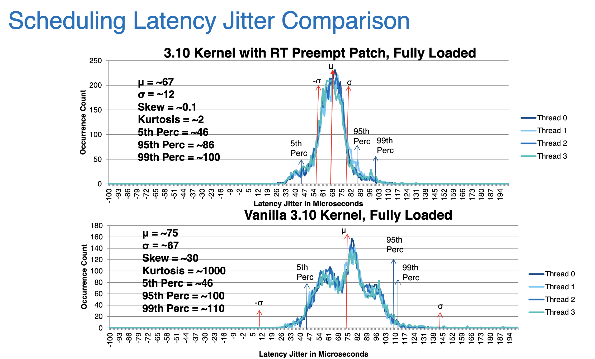
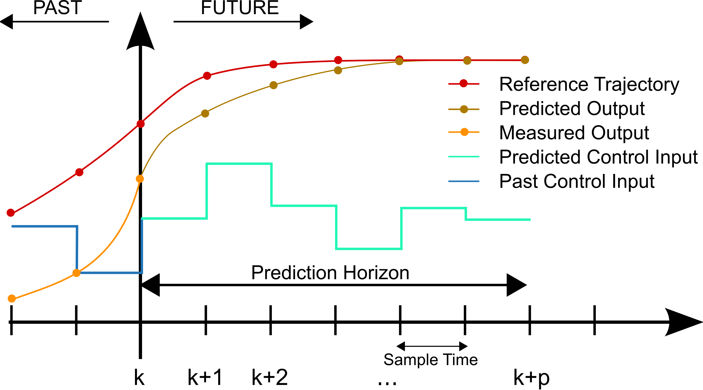
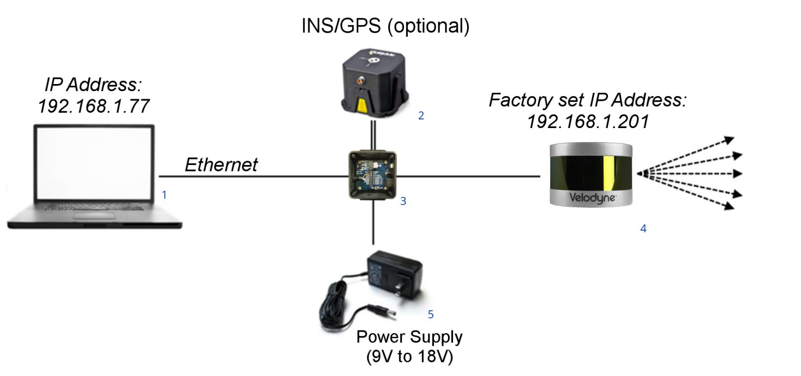

# 调研报告

[TOC]

## 项目成员

- 黄霖华
- 吴天铭
- 许元元
- 乐亦康

## 项目简介

本项目旨在基于现有的实时操作系统技术，借助仿真模拟平台和高还原度的可编程车，对多个物理终端的**实时沟通和调度问题**进行解决，并希望以此作为对万物互联纪元智能交通系统的重要课题——多运载终端实时沟通和协同问题的一次积极实践。

## 项目背景

### 智能交通系统

智能交通系统（Intelligent Traffic System，简称ITS）又称智能运输系统（Intelligent Transportation System），是将先进的科学技术（信息技术、计算机技术、数据通信技术、传感器技术、电子控制技术、自动控制理论、运筹学、人工智能等）有效地综合运用于交通运输、服务控制和车辆制造，加强车辆、道路、使用者三者之间的联系，从而形成一种保障安全、提高效率、改善环境、节约能源的综合运输系统。

#### 智能交通系统的当下与未来

当前的智能交通系统解决方案有如下特点：

- 解决的通常是宏观的道路拥堵和车流引导问题，而很少聚焦于**单一车辆的行为控制和建议**，例如：
  1. 当前的导航系统确实会提示某路段拥堵并给出建议的替代路线，但对于所有车辆的建议往往导致另一路段开始拥堵，更合理的方案应该是建议一部分车辆更改路线。
  2. 当前的智能交通系统没有对于运载终端具体行为的统一调度。
- 智能公路与安全辅助驾驶层面做出的尝试（例如自动驾驶）往往局限于决策单一车辆的运行而**缺乏统一调度**。
- 每个运行的终端往往至多充当传感器的功能（例如上传车辆信息），而**不是可控制的物理终端**。

而随着社会经济的发展与信息化进程的继续，大数据为模拟和预测未来交通状态提供了可能，云计算为庞大规模的统一运算提供了基础，而5G技术的普及，也使得交通系统中的终端各个终端得以互联。在万物互联的新纪元，智能交通系统需要做到化整为零——通过对于每一个运载终端的合理控制或建议，达到交通规划的全新高度。在未来智能交通系统的设想中，有如下特点：

- 以**控制运载终端**的方式解决宏观的道路问题；
- 超高的**实时性**和**安全性**，保证交通参与者的安全和舒适度。

### 实时操作系统

实时操作系统（RTOS）是指当外界事件或数据产生时，能够接受并以足够快的速度予以处理，其处理的结果又能在规定的时间之内来控制生产过程或对处理系统做出快速响应，调度一切可利用的资源完成实时任务，并控制所有实时任务协调一致运行的操作系统。提供及时响应和高可靠性是其主要特点。

#### 实时操作系统解决的问题

实时操作系统在通用操作系统的基础上，主要解决了以下问题：

- **高精度计时问题**。计时精度是影响实时性的一个重要因素。在实时应用系统中，经常需要精确确定实时地操作某个设备或执行某个任务，或精确的计算一个时间函数。这些不仅依赖于一些硬件提供的时钟精度，也依赖于实时操作系统实现的高精度计时功能。
- **多级中断问题**。一个实时应用系统通常需要处理多种外部信息或事件，但处理的紧迫程度有轻重缓急之分。有的必须立即作出反应，有的则可以延后处理。因此，需要建立多级中断嵌套处理机制，以确保对紧迫程度较高的实时事件进行及时响应和处理。
- **实时调度问题**。实时操作系统不仅要及时响应实时事件中断，同时也要及时调度运行实时任务。但是处理机调度并不能随心所欲的进行，因为涉及到两个进程之间的切换，只能在确保“安全切换”的时间点上进行，实时调度机制包括两个方面，一是在调度策略和算法上保证优先调度实时任务；二是建立更多“安全切换”时间点，保证及时调度实时任务。

#### 实时操作系统的优势

实时操作系统相对于通用操作系统的优势如下：

- **多路性**。实时信息处理系统与分时系统一样具有多路性。系统按分时原则为多个终端用户服务；而对实时控制系统，其多路性则主要表现在经常对多路的现场信息进行采集以及对多个对象或多个执行机构进行控制。
- **独立性**。实时信息处理系统与分时系统一样具有独立性。每个终端用户在向分时系统提出服务请求时，是彼此独立的操作，互不干扰；而在实时控制系统中信息的采集和对对象的控制，也彼此互不干扰。
- **及时性**。实时信息系统对实时性的要求与分时系统类似，都是以人所能接受的等待时间来确定；而实时控制系统的及时性，则是以控制对象所要求的开始截止时间或完成截止时间来确定的，一般为秒级、百毫秒级直至毫秒级，甚至有的要低于100微秒。
- **交互性**。实时信息处理系统具有交互性，但这里人与系统的交互，仅限于访问系统中某些特定的专用服务程序。它不像分时系统那样能向终端用户提供数据处理服务、资源共享等服务。
- **可靠性**。分时系统要求系统可靠，相比之下，实时系统则要求系统高度可靠。因为任何差错都可能带来巨大的经济损失甚至无法预料的灾难性后果。因此，在实时系统中，采取了多级容错措施来保证系统的安全及数据的安全。

#### 本次项目中可以尝试的操作系统

##### RT Linux

实时 Linux 通过更改内核调度策略、在内核代码中加入更多可被抢占的时间点，来实现实时调度。借助 Linux 的强大兼容性，实时 Linux 可以直接运行在大多数的通用计算设备上。

从上图可以看到，实时 Linux 能提供的延迟保障大约在 0.1ms 级别。

实时 Linux 是一个 95% 实时系统。可以试一试树莓派搭载实时 Linux 能否驱动硬件并达到良好的实时性。可能的限制因素有：

- 实时性可能不够；
- 树莓派的 GPIO 接口、PWM 接口数量比较有限；
- 搭载实时 Linux 的树莓派不一定还有额外的资源来做高级计算（例如寻路算法），需要仔细想好计算单元的配置。必要时需要再外加一个计算单元来做寻路一类的算法。

##### nuttX

nuttX 是一个开源实时操作系统，主要针对嵌入式设备。

嵌入式设备/**单片机**/微处理器的资源非常局限。nuttX 部署的方式一般是：将用户程序和操作系统放在一起，编译、静态链接得到一整个程序文件，然后烧写到单片机中。nuttX 起到的作用主要是：

- 一定程度上包装裸金属的底层实现，程序员就不需要自己操作**内存映射 I/O**；
- 提供调度能力，让多个进程可以同时运行，且保持实时性；
- 如果需要的话，还可以提供更多的功能，例如文件系统读写、无线网络设备驱动等，但是需要更多资源，需要视硬件情况而定。不需要的功能可以在编译时裁剪，保障程序文件小巧。

nuttX的主要特性如下：

* 紧凑，对硬件要求低，适用于嵌入式系统；
* 系统功能丰富，在紧凑的基础上完全兼容 POSIX 标准；
* 可部署于 8位 至 64位 的各种嵌入式平台；
* 提供完整的 GNU 工具链；
* 支持整个 C 标准库。也有 C++ 标准库实现；
* 支持各种高级功能，例如文件系统、网络设备等；
* 采用 BSD 开源代码协议，可以没有后顾之忧地进行商业使用。

### 控制技术方法

在当前流行的控制技术方法中，主要分为传统控制技术和与基于人工智能的控制技术。

#### 传统控制理论

传统控制方法通常基于先验的数学物理公式，根据目标要求的数值或者函数控制硬件。这一类方法适用于给出数据指向明确的控制信号，比如驱动小车以给定速度和方向运行等。其方法简单，计算成本较低，同时控制效果精确，可预测性高，适合直接部署在单片机中作为执行确定行动的程序。以下是常见的控制方法：

##### PID 控制

闭环控制系统的特点是系统被控对象的输出（被控制量）会反送回来影响控制器的输出，形成一个或多个闭环。闭环控制系统有正反馈和负反馈，若反馈信号与系统给定值信号相反，则称为负反馈（Negative Feedback），若极性相同，则称为正反馈，一般闭环控制系统均采用负反馈，又称负反馈控制系统。

PID 控制具体指如下三种方案：

* **比例控制**。比例控制是一种最简单的控制方式。其控制器的输出与输入误差信号成比例关系。
* **积分控制**。控制器的输出与输入误差信号的积分成正比关系。比例+积分控制器，可以使系统在进入稳态后几乎无稳态误差。
* **微分控制**。控制器的输出与输入误差信号的微分（即误差的变化率）成正比关系。在控制器中仅引入 “比例”项往往是不够的，比例项的作用仅是放大误差的幅值，而需要增加的是“微分项”，它能预测误差变化的趋势，这样，具有比例+微分的控制器，就能够提前使抑制误差的控制作用等于零，甚至为负值，从而避免了被控量的严重超调。

##### 模型预测控制 MPC

该方法基于优化的思想，将未来n步的控制输入作为自变量，通过已知的（可能不准的）系统模型，获得对应的未来n步的系统状态。设置一个标量函数评估系统状态和目标状态之差，通过优化的思想，可以获得未来n步的控制输入，使得未来n步系统状态和目标状态之差的加权和最小。

##### 事件触发控制

通过留出一定安全余量，设置一个苛刻但是形式简单的条件的方案，使得当输入条件满足要求时，触发控制，亦即不是逐帧的控制策略而是等待数据超过合理区间的控制方案。其常常运用于数值精确度需求不高但是需要节约运算资源的情况。

但是这种方式一次性计算非常多内容，计算压力更大。所以提出了自触发机制，这种机制实际上是通过设定了一个比较容易计算的问题来判断何时应该触发控制，当然，触发条件是被收紧了的。

##### 最小注意力控制

最小注意力控制也是一种自触发控制，但是并不依赖于一个固定的控制律，需要通过优化的方式来求解控制信号，使得系统触发控制的间隔时间最长。在本方案的实现过程中，可以利用控制李雅普诺夫方程简化优化过程，使该算法能够有可能在算力较低的机器人上实时运行。

#### 基于人工智能的控制理论

智能控制是以控制理论、计算机科学、人工智能、运筹学等学科为基础,扩展了相关的理论和技术,其中应用较多的有模糊逻辑、神经网络、专家系统、遗传算法等理论和自适应控制、自组织控制、自学习控制等技术。其方法可以拟合任意非线性目标，但由于其需要算力较高，适合间接部署在外部算力中完成路径规划与姿态决定等决策型任务。以下是常见的控制方法：

##### 专家系统

专家系统是利用专家知识对专门的或困难的问题进行描述. 用专家系统所构成的专家控制,无论是专家控制系统还是专家控制器，其相对工程费用较高,而且还涉及自动地获取知识困难、无自学能力、知识面太窄等问题。尽管专家系统在解决复杂的高级推理中获得较为成功的应用，但是专家控制的实际应用相对还是比较少。

##### 遗传算法

遗传算法作为一种非确定的拟自然随机优化工具，具有并行计算、快速寻找全局最优解等特点，它可以和其他技术混合使用，用于智能控制的参数、结构或环境的最优控制。

##### 神经网络

神经网络是利用大量的神经元按一定的拓扑结构和学习调整方法。它能表示出丰富的特性：并行计算、分布存储、可变结构、高度容错、非线性运算、自我组织、学习或自学习等。神经网络经过各种训练，其参数设置可以达到满足控制所需的行为，可作为万能逼近器解决非线性问题，并应用到控制器设计中。

### 本次项目中可以尝试的平台和设备

#### 计算平台

##### Jetson Modules

NVIDIA旗下的嵌入式计算设备。Jetson Modules可以为边缘设备提供AI算力资源。将该设备嵌入在小车上，可以方便模型的线下训练和部署。在网络不佳的情况下，该设备也可以作为高效的离线计算资源。此外，计算速度的提高也可以降低决策延迟，便于提高系统的实时性。

##### Arduino-uno

Arduino是一款便捷灵活、方便上手的开源电子原型平台，是一个微控制器，价格比树莓派便宜。包含硬件和软件。主要包含两个部分：硬件部分是可以用来做电路连接的Arduino电路板；另外一个则是Arduino IDE，你的计算机中的程序开发环境。你只要在IDE中编写程序代码，将程序上传到Arduino电路板后，程序便会告诉Arduino电路板要做些什么了。Arduino能通过各种各样的传感器来感知环境，通过控制灯光、马达和其他的装置来反馈、影响环境。板子上的微控制器可以通过Arduino的编程语言来编写程序，编译成二进制文件，烧录进微控制器。对Arduino的编程是通过 Arduino编程语言和Arduino开发环境(基于 Processing)来实现的。基于Arduino的项目，可以只包含Arduino，也可以包含Arduino和其他一些在PC上运行的软件，它们之间进行通信来实现。

Arduino-uno平台主要由以下特性：

* 跨平台；
* 简单易学。Arduino语言易于掌握，不需要太多的单片机的编程基础；
* 开放性。类似于FPGA开发板，其电路图等都是开源的。

#### 动力设备

##### RC-car

遥控车(RC-car)，是遥控模型的一种，以无线电或红外线等无线操控的方式控制的玩具车或模型车。遥控车的控制信号，通过手摇杆上的发射器发出，由装在车上的接收器接收。接收器根据接收到的射频信号控制车速、改变车轮的转动方向以及马达、伺服马达或引擎的运转。简单的遥控车只是能控制停与走的玩具，而高级的遥控车可以是功能强大的赛车，具所有实际赛车的复杂和可调节的特性，速度更可超过时速一百公里。遥控模型车不是玩具，它是"真正汽车的缩小版本"，它有着和汽车相同的悬挂系统，拥有着真车当中那些超级跑车的操控感觉。

RC-car的控制器等部件可以和树莓派的GPIO接口相连，这样就可以通过树莓派控制RC-car。

此外，由于RC-car已经有了遥控的功能，可以通过摇杆操控RC-car较为方便地进行数据的收集等工作。

#### 雷达

摄像头作为传感器有一个问题，就是光照强度的变化会对算法的效果产生明显的影响。利用雷达作为传感器，我们可以在较暗的环境下实现对小车的自动控制。此外，雷达能对周围空间进行较好的3D建模，这样小车的位置、轨迹就能得到更精准地刻画。

##### Velodyne Lidar

在预算允许的情况下，Velodyne Lidar Puck红外探测雷达可以辅助摄像头，提供对路况更好的探测。VLP-16 传感器使用一组 16 个红外 (IR) 激光器与红外探测器配对来测量到物体的距离。这设备牢固地安装在一个紧凑的外壳内。激光/探测器对阵列在其固定外壳内快速旋转扫描周围环境，每束激光大约每秒发射 18,000 次，实时提供一组丰富的 3D 点数据。先进的数字信号处理和波形分析提供高度准确的远程感应以及校准的反射率数据，从而能够轻松检测路标、车牌和车道标记等后向反射器。传感器数据以 UDP 数据包的形式通过以太网实时提供给应用程序接口。利用此传感器的数据，更好地探索、搭建更强大的运行模型。

##### Ouster OS1 Lidar

RC Car ML Model Development with an Ouster OS1 Lidar中，作者用Ouster OS1 Lidar作为主要的传感器输入，实现了RC Car的自动驾驶。若选用该型号的雷达，可以参照blog中的内容实现基础的数据分析和处理的功能。

#### Camera

##### PiCam

PiCam与树莓派自然对接，无需修改额外的配置文件就可在树莓派上使用。

##### Jetson

若选用Jetson系列的计算硬件，可以参照Jetson Partner Supported Cameras官网给出的方案来挑选摄像头并按照给出的配置方法完成配置。

### 本次实验中可以尝试的仿真平台

#### 预仿真平台

##### Simulink

使用 MATLAB 和 Simulink，我们可以开发路径规划和控制算法。可以使用横向和纵向控制器设计车辆控制系统，使自主驾驶终端能够遵循规划的轨迹，使用传感器模型和车辆动力学模型，在二维和三维仿真环境中合成式地测试算法，伴随轨迹的仿真检验其效果。

#### 仿真平台

##### CarSim

是 Mechanical Simulation 公司开发的强大的动力学仿真软件，被世界各国的主机厂和供应商所广泛使用。 CarSim 针对四轮汽车，轻型卡车，符合我们的设计面向对象，其有着多方面的优越性，使得成为**较为中意**的仿真平台。

\- **CarSim 模型在计算机上运行的速度可以比实时快 10 倍，模拟结果高度逼近真实车辆。** 可以仿真车辆对驾驶员控制， 3D 路面及空气动力学输入的响应， 主要用来预测和仿真汽车整车的操纵稳定性、 制动性、 平顺性、 动力性和经济性。 

\- **CarSim 自带标准的 Matlab/Simulink 接口， 可以方便的与 Matlab/Simulink 进行联合仿真**， 用于控制算法的开发。

\- **同时在仿真时可以产生大量数据结果用于后续使用 Matlab 或者 Excel 进行分析或可视化。** 

\- CarSim 同时提供了 **RT 版本**， 可以支持主流的 HIL 测试系统， 如 dSpace 和 NI 的系统， 方便的联合进行 HIL 仿真。

##### 大疆实验平台

总体推荐，内含由大疆开发的仿真软件，能够提供准工业级仿真、丰富应用场景并且拥有较为成熟且健康的生态，总结优势如下 

\- 实验室有容易获取的实物平台（S1系列机器人）；

\- 支持图形化界面编程，Python编程；

\- 能够提供准工业级的仿真和丰富的应用场景；

\- 生态较为健康，并且文档支持很齐全；

\- 接口完整（S1和EP系列均是）：

Related Links：[DJI Python API List](https://github.com/program-in-chinese/overview/wiki/大疆Python-API列表) and [S1-ap(dji.com)](https://bbs.dji.com/forum.php?mod=viewthread&tid=227127)

##### Airsim

由微软开发的仿真器，基于虚幻引擎。主要面向无人机仿真，也提供了驾驶仿真的接口。适用于驾驶决策仿真任务。输出的数据模态包括GPS，IMU，RGB图像，深度图，语义分割，红外相机，事件相机，点云（部分功能额外配置）。

优劣势陈述：

\- 封装过于严密，自定义地图，NPC，天气都不可行

\- 接口调用比较简单，容易上手

\- 更适合Windows系统用户。Github上提供的地图适用于驾驶仿真很少，但是AirSim可以从[Unreal Engine Market](https://link.zhihu.com/?target=https%3A//www.unrealengine.com/marketplace/en-US/store)中获取更多可用于自动驾驶的地图，其中绝大多数都只兼容Windows。

##### Apollo

Apollo是由百度-阿波罗开发的高性能框架，用于加速自动驾驶汽车的开发、测试和部署。同时该计划还包括了一系列仿真平台、硬件开发套件等。Apollo已经开放了超过22万行代码，形成了开源开发生态。可以支持一定功能的在线仿真，并且我们已经申请到了在线使用的权限，当然主要仍是个人电脑安装运行的仿真器。

排除理由：

\- 官方提供的场景比较少，大型地图屈指可数。尽管这一点对于我们要求也不是太高，大约三个以上的真实场景就已经可以满足我们的需求

\- 封装得比较严实，不过改地图，放npc的自由设置空间还是有的

\- 配套的硬件开发套件价值高昂，并且功能溢出比较显然

\- **文档支持不足**，可以说是排除这一平台的主要原因

##### 其他可选项

Unity、华为自动驾驶云服务 Octopus、SUMO、Cognata等

## 相关工作

### Waymo Driver

Waymo 前身是 Google 于 2009 年推出的自动驾驶汽车项目。Waymo Driver 采用全自动驾驶技术，车上不需要驾驶员辅助监视汽车的运行状况。Waymo 已经在美国 13 个州进行测试，行驶里程已达数十亿英里。

在 Waymo Driver 开始在新区域运营之前，公司首先会极为详细地绘制该地区的地图，包括车道标记线、停车标志、路缘和人行横道等。然后，Waymo Driver 便会将这些特别详细的自定义地图与实时传感器数据搭配使用（而不仅仅依赖于信号强度不稳定的 GPS 等外部数据），以便随时确定其确切的道路位置。

Waymo Driver 的感知系统能够从其高级传感器套件中收集复杂的数据，并通过机器学习等技术识别周围的对象，包括行人、骑行者、车辆和建筑物等。Waymo Driver 还能识别标志和信号（例如不同颜色的交通信号灯以及临时停车标志）并做出响应。

Waymo 采用了预先标记数据与车载传感器结合的方式，所有的决策都由车载计算单元完成。相当于只考虑了自身车体在现有交通环境下的安全驾驶，契合当前的技术现状。

### 总结

可以从以上典型的工业工程解决方案中看出，当下的交通系统智能控制方案仍主要针对单一运载单元的性能优化，而对于多智能终端的协调控制方案探索较少。

## 立项依据

如项目背景和工业界相关工作部分中所述：

1. 在万物互联的新纪元，智能交通系统需要做到化整为零——通过对于每一个运载终端的合理控制或建议达到交通规划的全新高度。
2. 现有的、在智能公路与安全辅助驾驶层面做出的尝试（例如自动驾驶）往往局限于决策单一车辆的运行而**缺乏统一调度**。
3. 现有智能交通系统中，每个运行的终端往往至多充当传感器的功能（例如上传车辆信息），而**不是可控制的物理终端**。

面对上述现状，我们希望对多个物理终端的实时沟通和调度问题做出尝试。当下主流的自动驾驶方案，即使部署在每一个终端上，都只能被理解为“对每一个单元自私”的控制方案，缺乏全局的协调和统一性。我们认为，交通系统作为一个**有机整体**，全局的规划才能激发整个系统最大的可能。而实时操作系统，正是实现多终端通信、调度和协作的目标中的重要一环。

我们在本次项目中，拟通过在多个可编程终端以及服务器上部署实时操作系统，以模拟现实的交通环境并探索实时操作系统在多终端通信、协调方面的潜力与可能，并以此作为对万物互联纪元智能交通系统的重要课题——多运载终端实时沟通和协同问题的一次积极实践。

## 前瞻性/重要性分析

在我们的设计中，智能交通系统能够完成庞大规模的统一运算。在终端互联的情况下，智能交通系统能够化整为零，对于**每一个运载终端**进行合理控制/建议，解决宏观的道路问题；同时，每个运载终端可以以超高的**实时性和安全性**保证交通参与者的安全与舒适度。

我们希望在本次项目中，探究**实时操作系统**在未来设想下的智能交通系统中所能发挥的作用与潜力，并希望以此为日后的有关研究提供可供参考的先例。以下是未来设想下的智能交通系统中实时操作系统可能发挥的作用：

### 运载终端自身的准确控制

运载终端自身的准确控制是智能交通系统的基石。载具需要保证其中乘客的**安全**和**舒适度**，以稳定健壮的方式运行，这需要载具计算系统对物理实体能够实现精确控制。

实现了实时精确控制的载具，首先能够保证乘客的安全，完成急停、避障等操作；其次能够做到准确的路径和速度控制，涉及到一系列反馈调节和电子控制的问题；最后能保证乘客乘坐的舒适度，精细控制车体的加速度乃至速度的二阶导数的变化范围。

### 对运载终端的宏观调度

在实现了载具精准控制的前提下，通过载具之间的信息共享和云端互联，配合云计算，实现运输终端的宏观调度。

现有的民用导航系统已经可以提示某路段拥堵并给出建议的替代路线；但对于所有车辆的建议往往导致另一路段开始拥堵。这是由于导航系统仅提供了信息共享，而并未起到调度的作用。更合理的方案应当是建议一部分车辆更改路线，以分流的方式缓解局部拥堵等情况。

如果云计算平台足够强大，可以将云端调度从给出建议进一步细化到给出具体行为的控制。通过对每一个运输终端的合理控制，达到交通规划的新高度。

## 参考文献

- [智能交通系统](https://en.wikipedia.org/wiki/Intelligent_transportation_system)
- [控制技术方法](https://zhuanlan.zhihu.com/p/282778837 )
- [PID](https://zh.wikipedia.org/wiki/PID控制器)
- [模型预测控制（Model predictive control、MPC）](https://zh.wikipedia.org/wiki/%E6%A8%A1%E5%9E%8B%E9%A0%90%E6%B8%AC%E6%8E%A7%E5%88%B6)