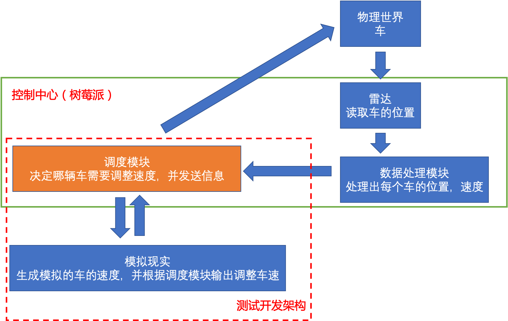

5.17 讨论

大致技术路线：

小车搭载树莓派。利用车载视觉，识别地上的预设路线，并沿着路线行驶（模拟驾驶员根据已知路线行进）。小车车载只实现基本的避障，遇到障碍之后减速停下。

控制中心也是树莓派，需要使用 PREEMPT_RT Linux。利用雷达追踪每个小车的位置，进行轨迹预测，预测的信息反过来可以协助雷达定位并为小车标号。雷达处理出所有车的位置和速度后，调度算法决定调度策略。通过无线网络将调度策略发送至车辆。

为了避免雷达对车辆编号出现错乱，雷达的识别结果周期性发送给旁边的笔记本电脑，笔记本电脑通过摄像头和颜色识别来进行校验。笔记本电脑不参与调度决策，只负责校验雷达识别结果。

红色虚线框的部分在物理实体到位之前就可以开始开发调试了。