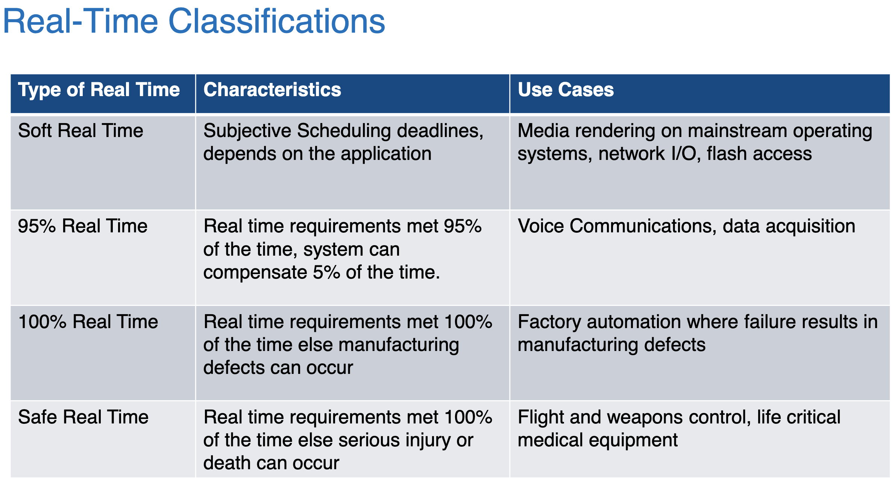
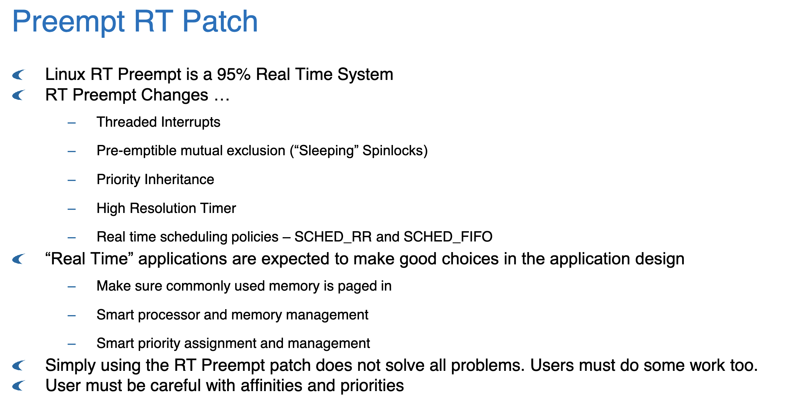
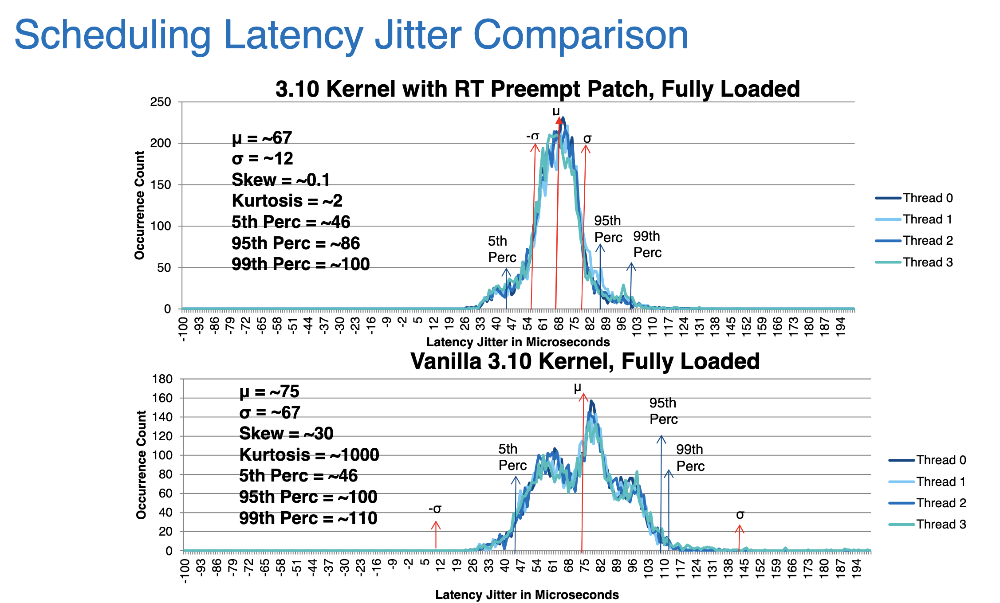

# 计算单元基本情况

## 通用计算设备

通用架构：可以运行 Linux，软件方面什么都能跑，也不需要做什么特殊配置。操作起来跟 PC 一样。

* 树莓派

树莓派是一个 arm 架构的机器，约是一张银行卡大小。树莓派上搭载了无线网络和蓝牙模块，也是不需要特殊配置。同时树莓派有 GPIO 接口，这些接口中共有 4 个硬件 PWM 接口，可以以一定的占空比输出电压脉冲，以达到自由控制平均输出电压的目的。其余的 GPIO 接口也可以用软件实现 PWM，但性能不好。

也就是说树莓派理论上可以与马达或者马达驱动板进行交互，但实时性暂时不乐观，且接口个数略有局限。

## 单片机

单片机搭载微处理器。通常是哈佛结构。运行的程序只能通过计算机烧写的方式改变：通过专用编程软件，将高级语言转化成指令序列，烧写到单片机的程序存储器中。

单片机上常常**不运行操作系统、直接运行用户程序**，或是通过实时操作系统来运行用户程序。实时性有很好的保障。可以用来操作硬件。

* 树莓派 Pico
* STM32

stm32是成熟的单片机解决方案，有很多功能不同的型号可以选。stm32 使用的是 arm 架构。

# 实时OS调研

根据实时性的不同要求，实时操作系统可以有以下几种分类，对应不同的实时性要求。**对硬件进行操作，应该需要至少 95% 到 100% 的实时性。**

https://elinux.org/Realtime_Testing_Best_Practices

## RT Linux

实时 Linux 通过更改内核调度策略、在内核代码中加入更多可被抢占的时间点，来实现实时调度。借助 Linux 的强大兼容性，实时 Linux 可以直接运行在大多数的通用计算设备上。

上图采用自 [Altera 2015](https://elinux.org/images/d/de/Real_Time_Linux_Scheduling_Performance_Comparison.pdf)。可以看到，实时 Linux 能提供的延迟保障大约在 0.1ms 级别。

实时 Linux 是一个 95% 实时系统。可以试一试树莓派搭载实时 Linux 能否驱动硬件并达到良好的实时性。可能的限制因素有：

1. 实时性可能不够
2. 树莓派的 GPIO 接口、PWM 接口数量比较有限
3. 搭载实时 Linux 的树莓派不一定还有额外的资源来做高级计算（例如寻路算法），需要仔细想好计算单元的配置。必要时需要再外加一个计算单元来做寻路一类的算法

## nuttX

[nuttX @ GitHub](https://github.com/apache/incubator-nuttx)

[nuttX home](https://nuttx.apache.org/)

nuttX 是一个开源实时操作系统，主要针对嵌入式设备。同时它实现了 POSIX 接口，因此编程环境学习成本不大。

嵌入式设备/**单片机**/微处理器的资源非常局限。nuttX 部署的方式一般是：将用户程序和操作系统放在一起，编译、静态链接得到一整个程序文件，然后烧写到单片机中。nuttX 起到的作用主要是：

1. 一定程度上包装裸金属的底层实现。这样，程序员就不需要自己操作**内存映射 I/O**，而是可以调用系统提供的库函数。这些函数调用在编译时会做相应的优化
2. 提供调度能力，让多个进程可以同时运行，且保持实时性
3. 如果需要的话，还可以提供更多的功能，例如文件系统读写、无线网络设备驱动等，但是需要更多资源，需要视硬件情况而定。不需要的功能可以在编译时裁剪，保障程序文件小巧

### 特性

* 紧凑，对硬件要求低，适用于嵌入式系统
* 系统功能丰富，在紧凑的基础上完全兼容 POSIX 标准
* 可部署于 8位 至 64位 的各种嵌入式平台
* 提供完整的 GNU 工具链
* 支持整个 C 标准库。也有 C++ 标准库实现
* 支持各种高级功能，例如文件系统、网络设备等
* 采用 BSD 开源代码协议，可以没有后顾之忧地进行商业使用

### 初期体验

编译的过程跟 Linux 内核差不多，参考 OSH Lab1。nuttX 直接使用了 Linux 内核配置的 Kconfig 系统，因此配置过程会非常类似。

编译的时候需要准备好要运行的程序，称为“app”。这个程序会与 nuttX 一起被编译，最终生成一个单独的程序文件。

nuttX 默认使用 flat address space，即整个操作系统中的所有进程直接使用实际地址访问物理内存，而不对进程进行任何的内存映射。即使硬件有 MMU，也只是让 MMU 做全等映射。

[Memory Configurations - NUTTX](https://cwiki.apache.org/confluence/display/NUTTX/Memory+Configurations)

在 nuttX 上编程，可以参考：

https://nuttx.apache.org/docs/latest/reference/user/07_signals.html
