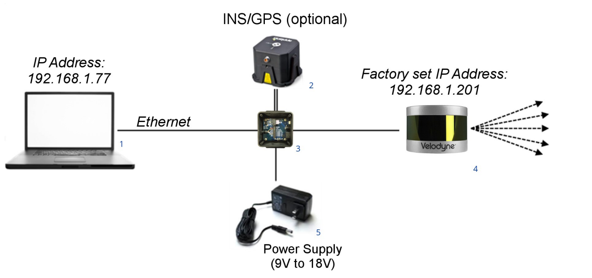

# 硬件相关的调研

我调研的硬件包括计算硬件、电机、传感器等，这些硬件可以组装成一个物理实体小车的底层部分，并于上层模块交互。

## 计算平台

### Jetson Modules

NVIDIA旗下的嵌入式计算设备。Jetson Modules可以为边缘设备提供AI算力资源。将该设备嵌入在小车上，可以方便模型的线下训练和部署。在网络不佳的情况下，该设备也可以作为高效的离线计算资源。此外，计算速度的提高也可以降低决策延迟，便于提高系统的实时性。

### Arduino-uno

Arduino是一款便捷灵活、方便上手的开源电子原型平台，是一个微控制器，价格比树莓派便宜。包含硬件（各种型号的Arduino板）和软件（ArduinoIDE）。主要包含两个部分：硬件部分是可以用来做电路连接的Arduino电路板；另外一个则是Arduino IDE，你的计算机中的程序开发环境。你只要在IDE中编写程序代码，将程序上传到Arduino电路板后，程序便会告诉Arduino电路板要做些什么了。Arduino能通过各种各样的传感器来感知环境，通过控制灯光、马达和其他的装置来反馈、影响环境。板子上的微控制器可以通过Arduino的编程语言来编写程序，编译成二进制文件，烧录进微控制器。对Arduino的编程是通过 Arduino编程语言 (基于 Wiring)和Arduino开发环境(基于 Processing)来实现的。基于Arduino的项目，可以只包含Arduino，也可以包含Arduino和其他一些在PC上运行的软件，它们之间进行通信 (比如 Flash, Processing, MaxMSP)来实现。

特性：
1. 跨平台。
2. 简单易学。Arduino语言易于掌握，不需要太多的单片机的编程基础。
3. 开放性。类似于FPGA开发板，其电路图等都是开源的。

个人认为这个Arduino-uno可以作为一个小型的控制器，执行一些简单的任务，比如驱动电机等等。

## 动力设备

### RC-car

遥控车(RC-car), 是遥控模型的一种，以无线电或红外线等无线操控的方式控制的玩具车或模型车。遥控车的控制信号，通过手摇杆上的发射器发出，由装在车上的接收器接收。接收器根据接收到的射频信号控制车速、改变车轮的转动方向以及马达、伺服马达或引擎的运转。简单的遥控车只是能控制停与走的玩具，而高级的遥控车可以是功能强大的赛车，具所有实际赛车的复杂和可调节的特性，速度更可超过时速一百公里。遥控模型车不是玩具，它是"真正汽车的缩小版本"，它有着和汽车相同的悬挂系统(suspension)，拥有着真车当中那些超级跑车的操控(handing)感觉。 

RC-car的控制器等部件可以和树莓派的GPIO接口相连，这样就可以通过树莓派控制RC-car了。[Donkey Car](https://docs.donkeycar.com/parts/rc/)上有一份详细的软硬件结合的教程，如果DIY的话可以参考一下这一条实现的路径。

市面上有很多RC-car的品牌供我们选择，比如[Traxxas](https://traxxas.com/)、Team Associated等。不少RC-car外形炫酷，适合展示。如果我们选用内燃机的RC-car, 还可以更加真实地模拟现实中的汽车。

此外，由于RC-car已经有了遥控的功能，这样我们可以通过摇杆操控RC-car较为方便地进行数据的收集等工作。

## 雷达

摄像头作为传感器有一个问题，就是光照强度的变化会对算法的效果产生明显的影响。利用雷达作为传感器，我们可以在较暗的环境下实现对小车的自动控制。此外，雷达能对周围空间进行较好的3D建模，这样小车的位置、轨迹就能得到更精准地刻画。如果将雷达和摄像头结合起来，我们可以采用machine learning, SLAM等方法的结合来导航小车。

### Velodyne Lidar

在预算允许的情况下，Velodyne Lidar Puck红外探测雷达可以辅助摄像头，提供对路况更好的探测。VLP-16 传感器使用一组 16 个红外 (IR) 激光器与红外探测器配对来测量到物体的距离。这设备牢固地安装在一个紧凑的外壳内。激光/探测器对阵列在其固定外壳内快速旋转扫描周围环境，每束激光大约每秒发射 18,000 次，实时提供一组丰富的 3D 点数据。先进的数字信号处理和波形分析提供高度准确的远程感应以及校准的反射率数据，从而能够轻松检测路标、车牌和车道标记等后向反射器。传感器数据以 UDP 数据包的形式通过以太网实时提供给应用程序接口。

利用这个传感器的数据，我们更好地探索我们的模型，搭建更强大的运行模型。

### Ouster OS1 Lidar

[RC Car ML Model Development with an Ouster OS1 Lidar](https://www.wilselby.com/2020/02/rc-car-ml-model-development-with-ouster-os1-lidar/)中，作者用Ouster OS1 Lidar作为主要的传感器输入，实现了RC Car的自动驾驶。选用该型号的雷达，我们可以参照blog中的内容实现基础的数据分析和处理的功能。

## Camera

### PiCam

[PiCam](https://www.adafruit.com/product/5247)与树莓派自然对接，无需修改额外的配置文件就可在树莓派上使用。

### Jetson

如果我们选用了Jetson系列的计算硬件，我们可以参照[Jetson Partner Supported Cameras](https://developer.nvidia.com/embedded/jetson-partner-supported-cameras?t1_max-resolution=4K)来挑选摄像头。配置方法可以参考摄像头的文档或[这篇文档](https://docs.donkeycar.com/guide/create_application/#camera-setup)。

## 参考资料
1. [Velodyne Lidar](https://velodynelidar.com/products/puck/)
2. https://github.com/sunmiaozju/smartcar
3. https://github.com/autorope/donkeycar
4. https://www.interviewbit.com/blog/arduino-vs-raspberry-pi/
5. [Jetson Modules](https://developer.nvidia.com/embedded/jetson-modules#jetson_tx2)
6. [RC Car ML Model Development with an Ouster OS1 Lidar](https://www.wilselby.com/2020/02/rc-car-ml-model-development-with-ouster-os1-lidar/)
7. https://blogs.lawrence.edu/makerspace/tag/self-driving-car/
8. [Ouster OS1 Lidar](https://ouster.com/zh-cn/products/scanning-lidar/os1-sensor/)
9. [Jetson Partner Supported Cameras](https://developer.nvidia.com/embedded/jetson-partner-supported-cameras?t1_max-resolution=4K)
10. [PiCam](https://www.adafruit.com/product/5247)

